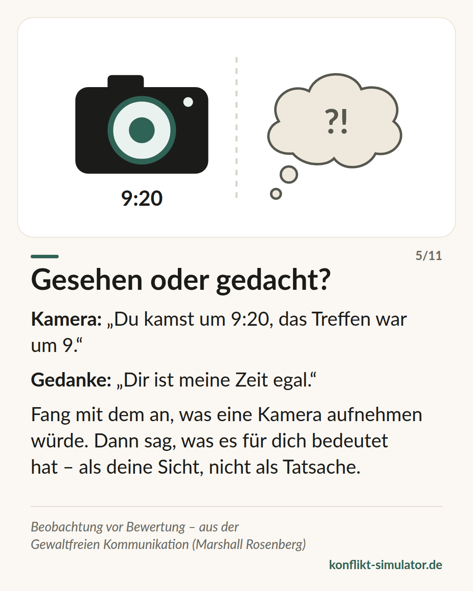

# Beobachten statt bewerten

*Eine Zuschreibung lädt zum Gegenbeweis ein. Was eine Kamera aufgezeichnet hätte, lässt sich nicht wegdiskutieren.*

## Was das Modell sagt

„Du bist unzuverlässig“ ist eine Bewertung. „Die Zuarbeit war für Donnerstag vereinbart und kam am Freitag“ ist eine Beobachtung. Beide meinen denselben Vorfall — aber nur die zweite kann die andere Person nicht bestreiten, und nur die zweite sagt ihr, worum es geht.

Marshall Rosenberg hat die Trennung von Beobachtung und Bewertung an den Anfang seiner vier Schritte gestellt: beobachten, fühlen, das Bedürfnis dahinter, bitten. Die Beobachtung ist der Schritt, an dem die meisten Gespräche schon scheitern, bevor sie begonnen haben.

Der Maßstab ist die Kamera: Was hätte eine Aufnahme festgehalten? Keine Absichten („absichtlich“), keine Muster („ständig“), keine Eigenschaften („respektlos“). Nur das, was war — einmal, konkret, überprüfbar.

## Woher es kommt

Marshall B. Rosenberg, amerikanischer Psychologe, „Nonviolent Communication: A Language of Life“ (1999, 3. Auflage 2015; deutsch „Gewaltfreie Kommunikation“). Der Konflikt-Simulator stützt sich auf die Arbeit von Marshall Rosenberg und des Center for Nonviolent Communication (cnvc.org); sein Autor ist kein vom CNVC zertifizierter Trainer.

Die Belege sind mittel: Eine systematische Übersicht (Juncadella 2013) fand vierzehn heterogene Studien, meist aus der Bildung, zu uneinheitlich für eine Metaanalyse. Einzelne kontrollierte Studien zeigen, dass Trainings die selbstberichtete Empathie verbessern. Für den ersten Schritt im Besonderen gilt: Dass Bewertungen Verteidigung auslösen und konkretes Verhalten eher Wirkung zeigt, deckt sich mit der Feedbackforschung — Feedback auf die Person statt auf die Sache verschlechtert Leistung häufig (Kluger und DeNisi 1996).

**Beleglage:** Teilweise belegt, Kern mit der Feedbackforschung vereinbar

## Was du vor dem Gespräch damit machen kannst

### Die Kamera laufen lassen

Schreib den Anlass so auf, wie eine Aufnahme ihn zeigen würde: Wann, was, wer hat was gesagt. Wenn im Satz ein Wort steht, das die Kamera nicht sehen kann, streich es.

### Einen Vorfall statt eines Musters

„Immer“ und „ständig“ sind nicht überprüfbar und laden zum Gegenbeispiel ein. Nimm den einen Fall, der für dich stellvertretend steht, und erzähl den.

### Deutung als Deutung kennzeichnen

Was es für dich bedeutet hat, darfst du sagen — als deine Sicht, nicht als Tatsache: „Für mich sah das aus, als wäre dir die Absprache nicht wichtig.“ Dann kann die andere Person es richtigstellen, ohne sich zu verteidigen.

## Wo der Konflikt-Simulator es benutzt

Die Anlass-Ebene des [Assistenten](https://konflikt-simulator.de/start) ist dieser Schritt. Drei Regelgruppen wachen darüber — Verallgemeinerungen, Zuschreibungen, Gedankenlesen —, jede mit ihrer Herkunft unter dem Hinweis; alle stehen auf der Seite [Alle Regeln](https://konflikt-simulator.de/regeln). Das Beweisfeld auf der Startseite prüft dieselbe Ebene an einem einzigen Satz, bevor du irgendetwas auswählst.

Die [Karte „Gesehen oder gedacht?“](https://konflikt-simulator.de/karten) stellt Kamera und Gedanke nebeneinander. Mehr zur [Methode](https://konflikt-simulator.de/methode) und zu zertifizierten Trainerinnen und Trainern beim [Center for Nonviolent Communication](https://www.cnvc.org) und beim [Fachverband Gewaltfreie Kommunikation](https://www.fachverband-gfk.org).

## Grenzen

Die Kamera sieht nicht alles: Ein Vorfall, sauber beobachtet, kann trotzdem Teil eines Musters sein, das dir zu Recht Sorge macht — dann gehört das Muster ins Gespräch, nur nicht in den ersten Satz. Wer jede Bewertung tilgt, klingt schnell wie ein Protokoll; die Deutung darf kommen, gekennzeichnet als deine. Und die vier Schritte als Formel gesprochen werden als Formel gehört — Rosenberg selbst hat vor dem „GFK-Sprech“ gewarnt.

## Quellen

- [Center for Nonviolent Communication](https://www.cnvc.org)
- [Fachverband Gewaltfreie Kommunikation](https://www.fachverband-gfk.org)
- [Juncadella (2013): Systematic review of NVC training studies](https://sites.google.com/site/empathytraininglitreview/training-papers/juncadella-2013)
- [Kluger & DeNisi (1996): The effects of feedback interventions on performance. Psychological Bulletin 119(2)](https://doi.org/10.1037/0033-2909.119.2.254)

Seite: https://konflikt-simulator.de/hintergrund/beobachten-statt-bewerten
