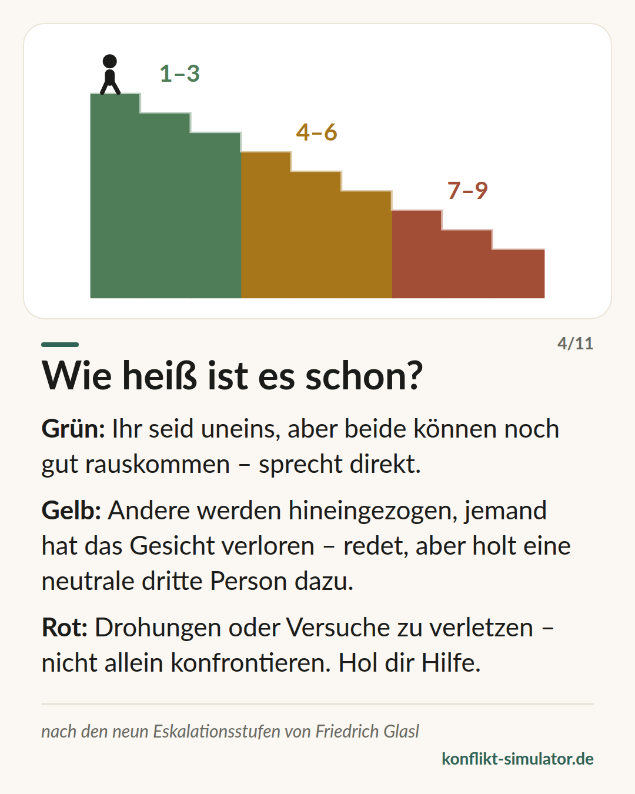

# Eskalationsstufen nach Glasl

*Neun Stufen, drei Phasen — und die Frage, ob du dieses Gespräch noch allein führen solltest.*

## Was das Modell sagt

Konflikte eskalieren nicht zufällig, sondern in erkennbaren Schritten. Friedrich Glasl beschreibt neun Stufen, die er als Treppe nach unten zeichnet: Mit jeder Stufe wird die Wahrnehmung enger und die Zahl der Auswege kleiner.

Die ersten drei Stufen — Verhärtung, Debatte, Taten statt Worte — sind noch ein Streit, bei dem beide gewinnen können. In den Stufen vier bis sechs kippt das: Man sucht Verbündete, stellt die andere Seite bloß, droht. Ab Stufe sieben geht es nur noch darum, der anderen Seite mehr zu schaden, als man selbst verliert.

Glasls Rat ist nüchtern: Selbsthilfe trägt etwa bis Stufe drei, mit Glück bis vier. Danach braucht es eine dritte Person — Moderation, Mediation, irgendwann ein Machteingriff.

## Woher es kommt

Friedrich Glasl, österreichischer Organisationsberater, veröffentlichte das Modell 1980 in „Konfliktmanagement. Ein Handbuch für Führungskräfte, Beraterinnen und Berater“ (Haupt / Freies Geistesleben), seit damals in vielen Auflagen. Die Kurzfassung „Selbsthilfe in Konflikten“ (1998) richtet sich an Betroffene selbst.

Das Modell ist Praxiswissen aus der Beratung, keine geprüfte Messskala: Die Reihenfolge der Stufen ist nicht psychometrisch validiert. Sie deckt sich aber gut mit der Eskalationsforschung, etwa bei Pruitt und Kim, und hat sich in vierzig Jahren Mediation und Organisationsberatung als Sprache bewährt, in der man über einen Konflikt reden kann, ohne ihn weiterzutreiben.

**Beleglage:** Praxiswissen, breit genutzt, nicht validiert

## Was du vor dem Gespräch damit machen kannst

### Vier Fragen stellen

Glaubt ihr beide noch, dass ihr beide gewinnen könnt? Werden andere hineingezogen? Hat jemand vor anderen das Gesicht verloren? Gab es Drohungen? Jedes Ja rückt dich eine Phase weiter.

### Die Phase entscheidet die Form

Grün: direkt reden. Gelb: reden, aber eine neutrale dritte Person einplanen — Teamleitung, Vertrauenslehrkraft, Mediation. Rot: nicht allein in die Konfrontation gehen.

### Nicht selbst eine Stufe tiefer steigen

Verbündete sammeln, alte Geschichten ausbreiten, mit Konsequenzen drohen — jede dieser Bewegungen ist selbst ein Schritt die Treppe hinunter. Der erste Satz entscheidet, ob du sie gehst.

## Wo der Konflikt-Simulator es benutzt

Der erste Schritt im [Assistenten](https://konflikt-simulator.de/start) ist die Lage: fünf Ja-Nein-Fragen nach Glasls Stufen. Ihr Ergebnis steht als grünes, gelbes oder rotes Band auf der Gesprächskarte und entscheidet, was der Assistent dir anbietet.

Die Bänder sind hier bewusst enger gezogen als auf der [Karte „Wie heiß ist es schon?“](https://konflikt-simulator.de/karten), die Glasls eigene Dreiteilung 1–3, 4–6, 7–9 zeigt. Die Lage schaltet schon ab Stufe vier auf Gelb und ab Stufe sechs, bei Drohungen, auf Rot. Der Grund ist Sicherheit: Wer bedroht wurde, soll kein Gespräch einüben, sondern zuerst Hilfe und Kontakte sehen. Dieselbe Linie zieht die [Regel zu Drohungen](https://konflikt-simulator.de/regeln) in der Bitte-Ebene.

## Grenzen

Die Treppe verführt dazu, der anderen Seite eine Stufe zuzuweisen — „der ist schon auf sechs“. Glasl beschreibt aber Beziehungen, nicht Personen; auf einer Stufe stehen immer beide. Außerdem ist die Einordnung eine Momentaufnahme nach fünf Fragen und keine Diagnose. Bei Gewalt oder Angst zählt nicht die Stufe, sondern der Weg zur Hilfe.

## Quellen

- [Merkblatt Konfliktanalyse nach Glasl (FGW e. V., PDF)](https://win.fgw-ev.de/media/merkblatt_konfliktanalyse.pdf)
- [Konflikteskalation nach Glasl — Überblick (Wikipedia)](https://de.wikipedia.org/wiki/Konflikteskalation_nach_Friedrich_Glasl)
- [Trigon Entwicklungsberatung, von Glasl mitgegründet](https://www.trigon.at)

Seite: https://konflikt-simulator.de/hintergrund/glasl-eskalationsstufen
