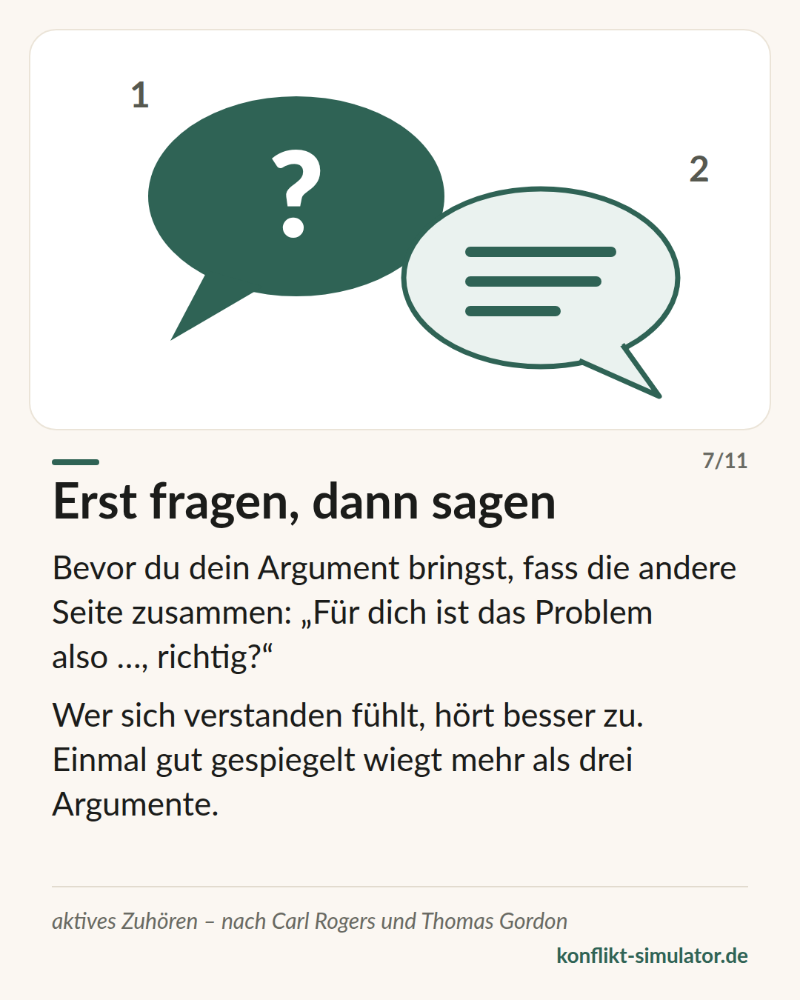

# Ich-Botschaften

*„Du machst mich wütend“ behauptet eine Ursache. „Ich werde wütend“ beschreibt, was passiert — und lässt sich nicht bestreiten.*

## Was das Modell sagt

Eine Du-Botschaft sagt der anderen Person, was mit ihr nicht stimmt. Eine Ich-Botschaft sagt, was mit mir passiert. Thomas Gordon hat ihr drei Teile gegeben: das Verhalten, ohne Bewertung („wenn das Geschirr bis morgens steht“), die konkrete Wirkung auf mich („muss ich es vor der Arbeit spülen“) und mein Gefühl dabei („und ich bin genervt“).

Die Ich-Form allein reicht nicht. „Ich finde, du bist unfair“ beginnt mit Ich und ist ein Urteil. „Ich fühle mich übergangen“ klingt nach Gefühl und ist eine Deutung dessen, was die andere Person getan hat. Eine echte Ich-Botschaft nennt ein Gefühl, das niemand bestreiten kann.

Dazu gehört bei Gordon die andere Hälfte: aktives Zuhören. Erst wiedergeben, was du gehört hast — dann antworten.

## Woher es kommt

Thomas Gordon, Schüler von Carl Rogers, hat die Ich-Botschaft 1970 in „Parent Effectiveness Training“ beschrieben (deutsch „Familienkonferenz“), später für Schule und Führung. In Deutschland kam sie über „Lehrer-Schüler-Konferenz“ (1977) in die Lehrerbildung; in Ruth Cohns Themenzentrierter Interaktion heißt die Regel „sprich per Ich, nicht per man“.

Die Belege sind gemischt und darum ehrlich zu nennen: Gesprächseröffnungen in der Ich-Form, die zugleich die Sicht der anderen Seite anerkennen, werden als am wenigsten feindselig bewertet (Rogers, Howieson und Neame 2018). In echten Paarstreits dagegen senkten Ich-Botschaften allein die Eskalation nicht — die Form trägt nicht, wenn Verachtung mitschwingt. Für aktives Zuhören ist die Lage besser: Wer gespiegelt wird, fühlt sich verstandener als mit Rat oder Zustimmung (Weger u. a. 2014).

**Beleglage:** Teilweise belegt — Form hilft, ersetzt aber keine Haltung

## Was du vor dem Gespräch damit machen kannst

### Drei Teile aufschreiben

Verhalten ohne Bewertung, Wirkung auf dich, dein Gefühl. Drei Zeilen. Wenn in der ersten ein Eigenschaftswort steht, ist es noch eine Du-Botschaft in Verkleidung.

### Das Gefühl prüfen

Steht da ein Gefühl — wütend, traurig, verunsichert — oder eine Deutung: übergangen, ignoriert, nicht ernst genommen? Die Deutung sagt, was die andere Person getan hat. Such das Gefühl darunter.

### Die erste Antwort spiegeln

Leg dir einen Satzanfang zurecht: „Du meinst also …“, „Wenn ich dich richtig verstehe …“. Wer sich verstanden fühlt, hört besser zu — und erst dann lohnt dein Argument.

## Wo der Konflikt-Simulator es benutzt

Die Wirkungs-Ebene des [Assistenten](https://konflikt-simulator.de/start) ist eine Ich-Botschaft in Gordons Sinn. Mehrere [Regeln](https://konflikt-simulator.de/regeln) prüfen sie: Du-Botschaften werden erkannt und, wo der Satzbau das sicher erlaubt, umgeschrieben; Pseudo-Ich-Botschaften und Deutungen statt Gefühlen bekommen eine Rückfrage; fehlt ein Gefühlswort ganz, sagt die Seite das. Die Regeln zu „man“ und „alle“ folgen Ruth Cohn.

Nach dem Ergebnis fragt „Wenn die andere Person antwortet“ nach deinem Zuhör-Satz — das ist aktives Zuhören für die Gesprächskarte. Die [Karte „Erst fragen, dann sagen“](https://konflikt-simulator.de/karten) fasst es zusammen; im [Übungsraum](https://konflikt-simulator.de/ueben/) kannst du das Spiegeln an einem Gegenüber üben.

## Grenzen

Eine Ich-Botschaft ist kein Zauberspruch. Wer sie mechanisch spricht, wird als Technik gehört und entsprechend beantwortet; wer sie bei einer Person anwendet, die droht oder verachtet, bekommt die Verachtung zurück. Sie ist auch keine Formel für jede Lage: Manche Anliegen brauchen ein klares „Hör auf damit“ und kein Gefühl. Und drei Teile heißt nicht drei Absätze — Gordon wollte einen Satz, dann zuhören.

## Quellen

- [Gordon Training International: Origins of the Gordon Model](https://www.gordontraining.com/thomas-gordon/origins-of-the-gordon-model/)
- [Rogers, Howieson & Neame (2018): I understand you feel that way, but I feel this way. PeerJ 6:e4831](https://peerj.com/articles/4831/)
- [Weger, Castle Bell, Minei & Robinson (2014): The relative effectiveness of active listening. International Journal of Listening 28(1)](https://doi.org/10.1080/10904018.2013.813234)

Seite: https://konflikt-simulator.de/hintergrund/ich-botschaften
