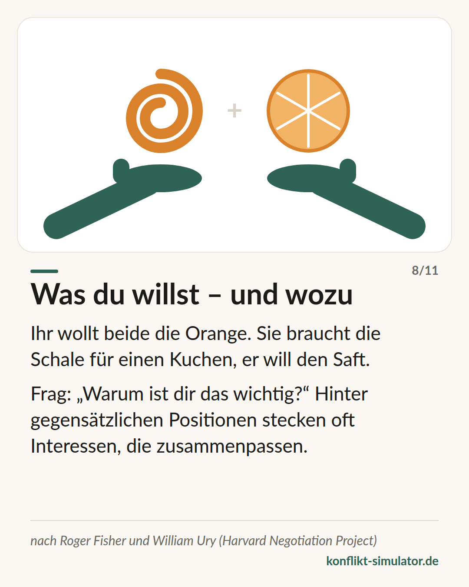

# Interessen statt Positionen

*Hinter dem, was jemand fordert, steht ein Grund — und zwei Gründe passen oft besser zusammen als zwei Forderungen.*

## Was das Modell sagt

Zwei Menschen wollen dieselbe Orange. Das ist eine Position. Sie braucht die Schale für einen Kuchen, er will den Saft — das sind Interessen, und sie passen zusammen. Roger Fisher und William Ury haben aus dieser Beobachtung eine Verhandlungsschule gemacht.

Ihre Grundsätze: Menschen und Probleme trennen — hart zur Sache, weich zu den Personen. Auf Interessen schauen, nicht auf Positionen. Mehrere Optionen entwickeln, bevor man sich für eine entscheidet. Und auf nachprüfbare Maßstäbe bestehen statt auf Druck.

Dazu kommt die Frage nach der besten Alternative: Was tust du, wenn ihr euch nicht einigt? Wer das weiß, muss sich weder anklammern noch einknicken.

## Woher es kommt

Roger Fisher und William Ury, „Getting to Yes“ (1981), ab der zweiten Auflage mit Bruce Patton; deutsch „Das Harvard-Konzept“. Entstanden im Harvard Negotiation Project, das die Autoren 1979 gegründet haben. Urys „Getting Past No“ (1991) behandelt schwierige Gegenüber.

Der Kern — Verhandeln über Interessen führt häufiger zu Lösungen, die beiden nützen — ist in der experimentellen Verhandlungsforschung gut gestützt (etwa De Dreu, Weingart und Kwon 2000). Das Buch als Paket ist Praxiswissen mit kulturellen Grenzen: Es setzt voraus, dass beide Seiten offen über Interessen sprechen können und wollen.

**Beleglage:** Kern gut belegt, Gesamtpaket Praxiswissen

## Was du vor dem Gespräch damit machen kannst

### Zweimal „wozu“ fragen

Was willst du? Und wozu? Was will die andere Person — und wozu? Zwei Zeilen pro Seite. Meist steht hinter beiden Positionen ein Interesse, das sich nicht ausschließt.

### Drei Optionen, bevor du eine forderst

Wer mit einer einzigen Lösung ins Gespräch geht, verhandelt um Ja oder Nein. Mit drei Vorschlägen, die beiden Interessen dienen, verhandelt ihr über das Wie.

### Deine Alternative kennen

Was passiert, wenn ihr euch nicht einigt — und ist das besser oder schlechter als das, was die andere Seite wahrscheinlich anbietet? Diese Frage nimmt der Angst die Spitze.

## Wo der Konflikt-Simulator es benutzt

Im Zwischenschritt „Die andere Seite“ des [Assistenten](https://konflikt-simulator.de/start) stehen zwei Zeilen: „Was will sie?“ und „Und wozu? Was steckt dahinter?“ Deine Antwort landet auf der Gesprächskarte unter „Die andere Seite“. Die Abmachung am Ende — wer, was, bis wann, wann prüfen wir — ist der nachprüfbare Maßstab aus demselben Konzept.

Die [Karte „Was du willst — und wozu“](https://konflikt-simulator.de/karten) erzählt die Orange auf einer Seite. Im [Übungsraum](https://konflikt-simulator.de/ueben/) hält das Gegenüber eine Position, und der Coach fragt, welches Interesse dahinterstecken könnte.

## Grenzen

Nicht jeder Konflikt ist eine Verhandlung. Wo es um Verletzung, Respekt oder Vertrauen geht, wirkt das Suchen nach „Optionen“ kalt, und die Beziehungsebene bleibt ungesagt. Das Konzept setzt außerdem eine gewisse Augenhöhe voraus; bei starkem Machtgefälle oder bei Drohungen tragen seine Grundsätze nicht. Und „hart zur Sache“ wird in manchen Kulturen als Angriff auf die Person gehört.

## Quellen

- [Program on Negotiation, Harvard Law School](https://www.pon.harvard.edu)
- [Getting to Yes — Überblick (Wikipedia)](https://en.wikipedia.org/wiki/Getting_to_Yes)
- [De Dreu, Weingart & Kwon (2000): Influence of social motives on integrative negotiation. JPSP 78(5)](https://doi.org/10.1037/0022-3514.78.5.889)

Seite: https://konflikt-simulator.de/hintergrund/interessen-statt-positionen
