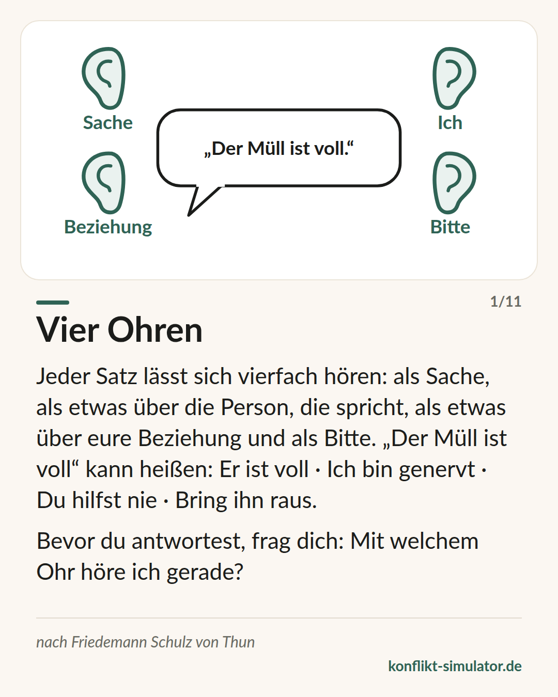

# Vier Ohren

*Jede Nachricht hat vier Seiten, und wer zuhört, hört oft eine andere als die gemeinte.*

## Was das Modell sagt

Ein Satz wie „Der Müll ist voll“ trägt vier Botschaften zugleich: eine Sache (der Eimer ist voll), eine Selbstkundgabe (mich stört das), eine Beziehungsbotschaft (ich halte dich für zuständig) und einen Appell (bring ihn raus). Friedemann Schulz von Thun nennt das Kommunikationsquadrat.

Die Pointe liegt beim Zuhören. Wer hört, hat vier Ohren und entscheidet, meist unbewusst, mit welchem er hört. Der eine hört die Sache und sagt „stimmt“. Die andere hört die Beziehung und sagt „immer bin ich schuld“. Beide haben denselben Satz gehört.

Viele Konflikte entstehen nicht an dem, was gesagt wurde, sondern an dem Ohr, das die andere Seite gerade aufhatte — und daran, dass niemand nachfragt.

## Woher es kommt

Friedemann Schulz von Thun, Psychologe in Hamburg, hat das Modell 1981 in „Miteinander reden 1“ (Rowohlt) vorgestellt; es baut auf Watzlawicks Unterscheidung von Inhalt und Beziehung und auf Bühlers Organonmodell auf. In Deutschland gehört es zum Lehrplan vieler Schulen und zur Grundausstattung jeder Führungskräfteschulung.

Empirisch ist es dünn belegt: Es gibt wenige Rezeptionsstudien, kein Experiment, das vier Ohren von drei oder fünf unterscheidet. Seine Stärke ist didaktisch — es gibt Menschen ein Vokabular, mit dem sie über Missverständnisse sprechen können, ohne jemandem Böswilligkeit zu unterstellen. Als solches ist es Praxiswissen, kein Befund.

**Beleglage:** Praxiswissen, didaktisch stark, kaum empirisch geprüft

## Was du vor dem Gespräch damit machen kannst

### Deinen ersten Satz vierfach lesen

Schreib ihn auf. Was ist die Sache? Was gibst du über dich preis? Was sagt er über eure Beziehung? Was soll die andere Person tun? Die Seite, die du nicht meinst, ist oft die lauteste.

### Das wahrscheinliche Ohr erraten

Mit welchem Ohr wird die andere Person hören — nach allem, was ihr zuletzt erlebt habt? Wenn du „Beziehung“ befürchtest, sag die Beziehungsbotschaft selbst, bevor sie geraten wird.

### Selbstkundgabe aussprechen

„Mich stört das“ ist die Seite, die wir am liebsten weglassen — und die die andere Person dann an unserem Ton abliest. Ausgesprochen ist sie weniger verletzend als erraten.

## Wo der Konflikt-Simulator es benutzt

Im optionalen Zwischenschritt „Die andere Seite“ des [Assistenten](https://konflikt-simulator.de/start) steht dein erster Satz oben, darunter die vier Ohren: Der Simulator schlägt vor, was die andere Person auf jeder Seite wahrscheinlich hört, und du korrigierst, wo du es besser weißt. Das Ergebnis landet auf deiner Gesprächskarte.

Im [Übungsraum](https://konflikt-simulator.de/ueben/) kommt die umgekehrte Richtung dazu: Dort antwortet ein Gegenüber, und der Coach fragt nach einer Runde, mit welchem Ohr du gerade gehört hast. Die [Karte „Vier Ohren“](https://konflikt-simulator.de/karten) fasst das Modell auf einer Seite zusammen.

## Grenzen

Das Quadrat erklärt Missverständnisse, löst sie aber nicht — es sagt dir nicht, welche Seite richtig ist. Es verführt auch dazu, der anderen Person das „falsche Ohr“ vorzuwerfen; dann wird aus einem Werkzeug zum Verstehen ein weiterer Vorwurf. Und ein Satz, der auf der Beziehungsseite wirklich verletzend ist, wird nicht besser, weil man ihn als „Sache“ deklariert.

## Quellen

- [Schulz von Thun Institut: die Modelle](https://www.schulz-von-thun.de/die-modelle)
- [Vier-Seiten-Modell (Wikipedia)](https://de.wikipedia.org/wiki/Vier-Seiten-Modell)

Seite: https://konflikt-simulator.de/hintergrund/vier-ohren
