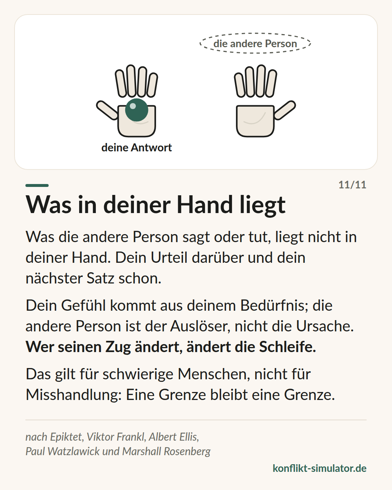

# Was in deiner Hand liegt

*Was die andere Person sagt, liegt nicht in deiner Hand. Dein Urteil darüber und dein nächster Satz schon — und damit die Schleife, in der ihr steckt.*

## Was das Modell sagt

„Du machst mich wütend“ klingt wie eine Beschreibung, ist aber eine Zuschreibung: Sie legt dein Gefühl in die Hand der anderen Person. Die kann dort nichts damit anfangen — außer sich zu verteidigen.

Die Unterscheidung ist alt: Was andere tun, liegt nicht bei dir. Dein Urteil darüber, dein Gefühl und dein nächster Satz schon. Das Gefühl kommt aus einem Bedürfnis von dir; die andere Person ist der Auslöser, nicht die Ursache.

Und weil ein Streit eine Schleife ist, in der jede Seite nur zu reagieren glaubt, reicht ein veränderter Zug, um sie zu verändern — nicht, weil die andere Person mitzieht, sondern weil der Kreis ohne deinen alten Zug anders läuft.

## Woher es kommt

Die älteste Wurzel liegt vor den Stoikern. Das Dhammapada beginnt mit „Der Geist geht allen Dingen voran“ (Verse 1–2), und das Sallatha-Sutta (SN 36.6) beschreibt zwei Pfeile: Das Ereignis ist der erste, die Reaktion, die wir hinzufügen, der zweite. Zwischen Gefühlston und Reaktion liegt ein Spalt — dort setzt die Vipassana-Praxis an. Der Coach im Simulator lehrt keine Kontrolle über Reaktionen, nur das Bemerken: „Was davon liegt bei dir?“ — dann ein Atemzug, keine Technik.

Epiktet, Enchiridion 1 und 5 (um 125 n. Chr.): Einiges steht in unserer Macht, anderes nicht; nicht die Dinge beunruhigen uns, sondern unsere Urteile über sie. Viktor Frankl beschrieb 1946 in „… trotzdem Ja zum Leben sagen“ die letzte Freiheit, die eigene Haltung zu wählen — der oft zitierte „Raum zwischen Reiz und Reaktion“ ist Stephen Coveys Paraphrase, nicht Frankls Wortlaut. Albert Ellis machte daraus in den 1950ern das ABC-Modell (Auslöser, Bewertung, Folge), den Anfang der Rational-Emotiven und später der Kognitiven Verhaltenstherapie. Niebuhrs Gelassenheitsgebet sagt dasselbe in drei Zeilen. Paul Watzlawick zeigte 1983 in „Anleitung zum Unglücklichsein“, wie man die eigene Schleife füttert, und mit der Zirkularität, warum ein Zug sie ändert.

Die Belege sind geteilt. Umdeuten (kognitive Neubewertung) dämpft Gefühle messbar: Die Metaanalyse von Webb, Miles und Sheeran (2012, 306 Studien) findet mittlere Effekte, deutlich stärker als für Unterdrücken. Dass ein veränderter Zug die Schleife ändert, ist Praxiswissen der systemischen Therapie, nicht gemessen.

**Beleglage:** Neubewertung gut belegt, der Rest Praxiswissen

## Was du vor dem Gespräch damit machen kannst

### Was davon liegt bei dir?

Schreib den Satz auf, der dich ärgert. Dann zwei Spalten: links, was die andere Person tut, rechts, was du daraus machst — Urteil, Gefühl, nächster Satz. Nur die rechte Spalte kannst du ändern.

### Den Zug der anderen Person vorhersagen

Schreib auf, was sie wahrscheinlich sagen wird, und daneben deine ruhige Antwort. Wer die Antwort schon hat, muss sie nicht unter Druck erfinden.

### Den einen Satz umdeuten

Nimm den Satz, der am meisten sticht („Du übertreibst“). Welche zweite Lesart gibt es? „Sie will, dass es weniger wird.“ Du musst sie nicht glauben, nur kennen.

## Wo der Konflikt-Simulator es benutzt

Die Linse „Worum geht es dir?“ im [Assistenten](https://konflikt-simulator.de/start) fragt nach Gefühl und Bedürfnis — die rechte Spalte. Der Schritt [Wenn-dann](wenn-dann-plaene.md) ist der vorhergesagte Zug mit deiner fertigen Antwort.

Im [Übungsraum](https://konflikt-simulator.de/ueben/) fragt der Coach in der Auszeit „Was davon liegt bei dir?“ und schickt die [Karte „Was in deiner Hand liegt“](https://konflikt-simulator.de/karten), wenn ein Satz die andere Person für dein Gefühl verantwortlich macht; die Karte „Wer hat angefangen?“ zeigt die Schleife.

## Grenzen

Das ist eine Haltung gegenüber schwierigen Menschen, kein Grund, Misshandlung hinzunehmen. Wer bedroht, gedemütigt oder kontrolliert wird, hat nichts umzudeuten: Die rote Stufe der Einschätzung bleibt rot, und manche Situationen brauchen eine dritte Person — Beratungsstelle, Vorgesetzte, Polizei.

## Quellen

- [Epiktet: Enchiridion (Handbüchlein der Moral), englische Übersetzung](http://classics.mit.edu/Epictetus/epicench.html)
- [Sallatha Sutta, SN 36.6: Der Pfeil (Access to Insight)](https://www.accesstoinsight.org/tipitaka/sn/sn36/sn36.006.than.html)
- [Dhammapada 1–2: Der Geist geht voran (Access to Insight)](https://www.accesstoinsight.org/tipitaka/kn/dhp/dhp.01.than.html)
- [Webb, Miles & Sheeran (2012): Dealing with feeling. A meta-analysis of emotion regulation strategies. Psychological Bulletin 138(4)](https://doi.org/10.1037/a0027600)

Seite: https://konflikt-simulator.de/hintergrund/was-in-deiner-hand-liegt
