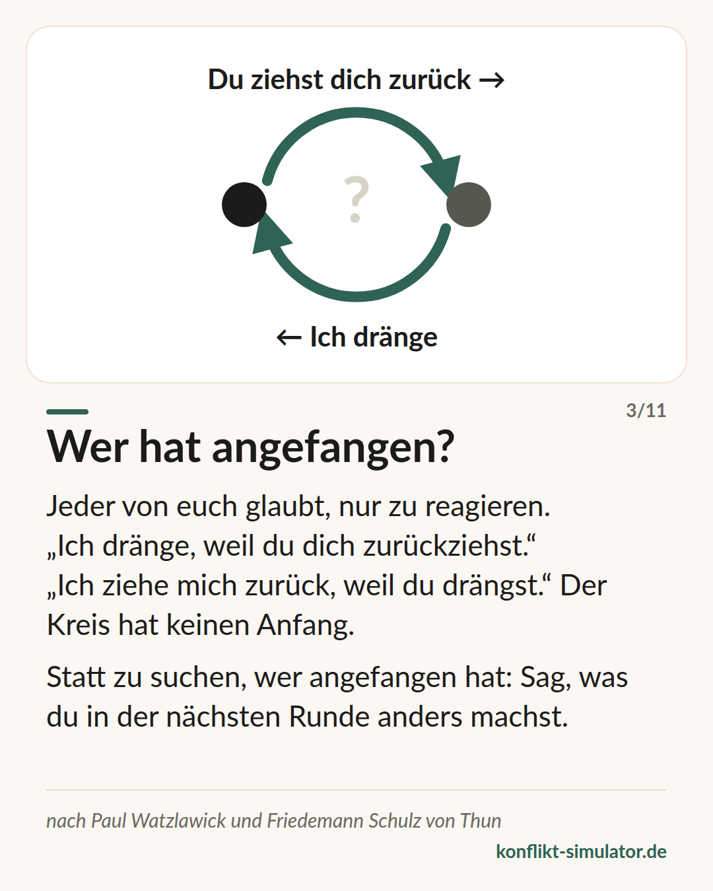

# Watzlawicks Axiome

*Man kann nicht nicht kommunizieren — und drei weitere Sätze, die einen Streit erklären, bevor er beginnt.*

## Was das Modell sagt

Paul Watzlawick und seine Kollegen haben 1967 fünf „vorläufige Axiome“ der Kommunikation formuliert. Drei davon braucht man vor einem schwierigen Gespräch.

Erstens: Jede Nachricht hat einen Inhalts- und einen Beziehungsaspekt, und der Beziehungsaspekt bestimmt, wie der Inhalt verstanden wird. Der Streit ums Geschirr ist selten ein Streit ums Geschirr.

Zweitens: Wie eine Beziehung erlebt wird, hängt von der Interpunktion ab — davon, wo jede Seite den Anfang setzt. „Ich dränge, weil du dich zurückziehst.“ „Ich ziehe mich zurück, weil du drängst.“ Beide haben recht, der Kreis hat keinen Anfang.

Drittens: Wir kommunizieren digital, mit Worten, und analog, mit Ton, Tempo, Gesicht. Die Worte tragen den Inhalt, das Analoge trägt die Beziehung. Passen beide nicht zusammen, glaubt das Gegenüber dem Analogen.

## Woher es kommt

Paul Watzlawick, Janet Beavin und Don D. Jackson, „Pragmatics of Human Communication“, Norton 1967; deutsch „Menschliche Kommunikation“, Huber 1969. Die Autoren gehörten zur Palo-Alto-Gruppe um Gregory Bateson und arbeiteten in der Familientherapie.

Die Axiome sind eine Heuristik, keine Theorie mit Vorhersagen: Sie lassen sich schwer prüfen, und die Autoren nannten sie selbst „tentativ“. Ihr Einfluss auf Familientherapie und Kommunikationswissenschaft ist enorm, ihre empirische Prüfung dünn. Für die Vorbereitung eines Gesprächs zählen sie als Praxiswissen — nützlich als Blick, nicht als Beweis.

**Beleglage:** Praxiswissen, einflussreich, schwer prüfbar

## Was du vor dem Gespräch damit machen kannst

### Die Beziehungsebene aussprechen

Sag, worum es dir neben der Sache geht: „Es geht ums Geschirr — und darum, ob ich dir wichtig bin.“ Was ausgesprochen ist, muss die andere Person nicht aus deinem Ton erraten.

### Den Kreis aufschreiben

Zwei Zeilen: „Ich … weil du …“ und „Du … weil ich …“. Wer den Kreis sieht, sucht nicht mehr nach dem Anfang, sondern nach der Stelle, an der er selbst aussteigen kann.

### Worte und Ton abgleichen

Wenn du verletzt bist und „nur eine Bemerkung“ ankündigst, hört die andere Person die Verletzung trotzdem — und reagiert auf sie, nicht auf die Bemerkung. Sag, was ist.

## Wo der Konflikt-Simulator es benutzt

Im Zwischenschritt „Die andere Seite“ des [Assistenten](https://konflikt-simulator.de/start) füllst du den Teufelskreis in zwei Zeilen aus; er steht danach auf deiner Gesprächskarte. Die Idee, Inhalt und Beziehung zu trennen, steckt auch in der Trennung der drei Ebenen Anlass, Wirkung und Bitte — die Wirkung ist die Beziehungsebene, ausgesprochen.

Zwei [Karten](https://konflikt-simulator.de/karten) tragen das Modell: „Sache und Beziehung“ und „Wer hat angefangen?“. Im [Übungsraum](https://konflikt-simulator.de/ueben/) merkt der Coach, wenn beide Seiten um das letzte Wort kämpfen.

## Grenzen

Das Kreismodell kann Verantwortung verwischen: Wo Gewalt, Drohung oder ein klares Machtgefälle im Spiel sind, gibt es einen Anfang, und ihn zu benennen ist keine Interpunktion, sondern notwendig. Und aus „man kann nicht nicht kommunizieren“ folgt nicht, dass man alles deuten darf — Schweigen hat viele Gründe, die man erfragen muss, statt sie zu lesen. Die oft zitierte Regel, Kommunikation sei zu 93 Prozent nonverbal, stammt nicht von Watzlawick und ist falsch.

## Quellen

- [Watzlawick, Beavin, Jackson: Some Tentative Axioms of Communication (1967, Kapitel als PDF)](https://www.neoscenes.net/teach/cu/2012_2/atls2000_mit/pdfs/Watzlawick-1967-Some_Tentative_Axioms_of_Communication.pdf)
- [Paul Watzlawick (Wikipedia)](https://de.wikipedia.org/wiki/Paul_Watzlawick)
- [Paul Watzlawick (Wikipedia, englisch)](https://en.wikipedia.org/wiki/Paul_Watzlawick)

Seite: https://konflikt-simulator.de/hintergrund/watzlawick-axiome
