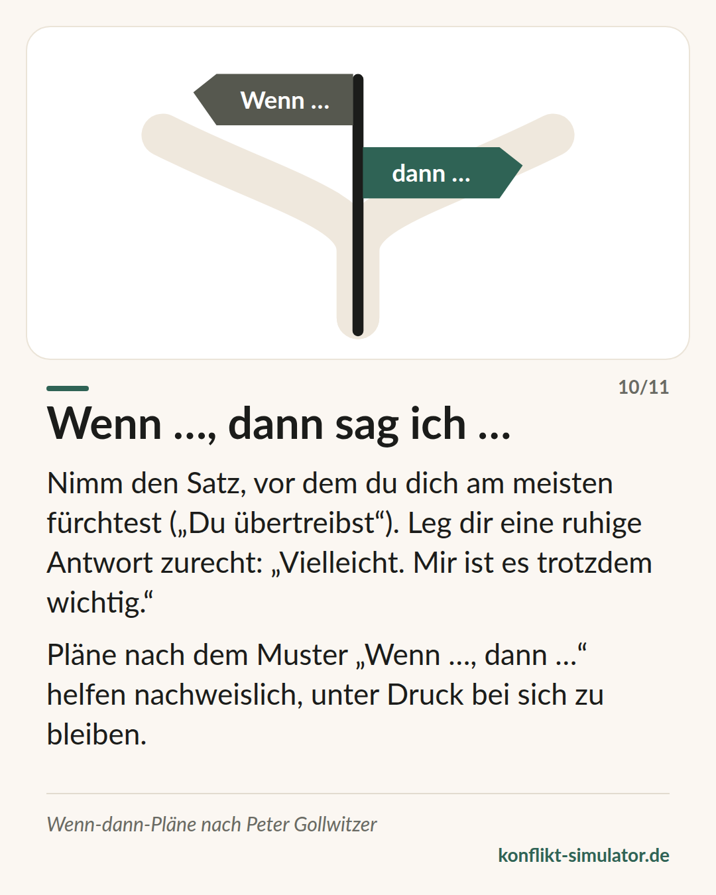

# Wenn-dann-Pläne

*Ein vorformulierter Satz für den Moment, den du am meisten fürchtest — das am besten belegte Werkzeug auf dieser Seite.*

## Was das Modell sagt

Ein Ziel zu haben („ich bleibe ruhig“) hilft wenig, wenn der Moment kommt. Ein Plan der Form „Wenn X passiert, dann tue ich Y“ hilft deutlich mehr. Peter Gollwitzer nennt das Implementation Intention, auf Deutsch Vorsatz oder Wenn-dann-Plan.

Der Mechanismus: Die Wenn-Bedingung wird zu einem Auslöser, den du im Gespräch fast automatisch erkennst, und die Dann-Handlung liegt schon bereit. Du musst in der heißen Sekunde nicht entscheiden, sondern nur abrufen.

Für ein schwieriges Gespräch heißt das: Such den Satz heraus, vor dem dir graut — „Du übertreibst“, „Jetzt fängst du wieder an“ — und leg dir eine ruhige Antwort zurecht. „Vielleicht. Mir ist es trotzdem wichtig.“

## Woher es kommt

Peter Gollwitzer, Sozialpsychologe (Konstanz, New York), veröffentlichte das Konzept 1999 im American Psychologist: „Implementation intentions: Strong effects of simple plans“. Die Metaanalyse von Gollwitzer und Sheeran (2006) fasst 94 Studien zusammen und findet einen mittleren bis großen Effekt auf das Erreichen von Zielen (d ≈ 0,65).

Das ist für ein Werkzeug der Gesprächsvorbereitung ungewöhnlich gut belegt: randomisierte Experimente, viele Bereiche, stabile Ergebnisse. Gabriele Oettingen hat daraus mit „WOOP“ eine Vier-Schritt-Übung gemacht (Wunsch, Ergebnis, Hindernis, Plan), die ebenfalls geprüft ist. Belegt ist die Wirkung auf das eigene Verhalten unter Druck — nicht, dass das Gespräch dadurch gut ausgeht.

**Beleglage:** Gut belegt — Metaanalyse über 94 Studien

## Was du vor dem Gespräch damit machen kannst

### Den gefürchteten Satz wählen

Nicht zehn Sätze, einen. Welchen Einwand erwartest du, und welcher würde dich am ehesten aus der Ruhe bringen? Der ist dein Wenn.

### Eine Antwort, die nicht zurückschlägt

Das Dann soll kurz sein, in der Ich-Form und ohne Gegenangriff: „Kann sein. Ich möchte trotzdem darüber reden.“ Sprich sie zweimal laut, damit sie dir im Mund liegt.

### Eine Pausenregel dazu

Ein zweiter Plan für den Fall, dass es kippt: „Wenn ich merke, dass ich laut werde, dann sage ich: Ich brauche zwanzig Minuten, dann komme ich zurück.“

## Wo der Konflikt-Simulator es benutzt

Am Ende des [Assistenten](https://konflikt-simulator.de/start) fragt „Wenn die andere Person sagt …“ nach genau diesem Satz: Du wählst aus typischem Gegenwind, bekommst eine ruhige Antwort dazu und einen Satz für den Fall, dass es trotzdem kippt. Beides steht auf der Gesprächskarte, der Wenn-dann-Plan auch im kopierten Text.

Die [Karte „Wenn …, dann sag ich …“](https://konflikt-simulator.de/karten) ist die Kurzfassung; im [Übungsraum](https://konflikt-simulator.de/ueben/) kannst du den Satz gegen ein Gegenüber ausprobieren, das wirklich blockt.

## Grenzen

Ein Plan macht einen schlechten Satz nicht gut: Wer sich „Wenn sie widerspricht, dann sage ich, dass sie schon wieder nichts versteht“ vornimmt, wird das zuverlässig tun. Der Plan wirkt auf dein Verhalten, nicht auf das der anderen Person — und er trägt nicht, wenn das Gespräch längst in Drohungen steckt. Zu viele Pläne machen steif; einer reicht.

## Quellen

- [Gollwitzer (1999): Implementation intentions. American Psychologist 54(7)](https://doi.org/10.1037/0003-066X.54.7.493)
- [Gollwitzer & Sheeran (2006): Metaanalyse, Advances in Experimental Social Psychology 38](https://doi.org/10.1016/S0065-2601(06)38002-1)
- [Gabriele Oettingen: WOOP](https://woopmylife.org)

Seite: https://konflikt-simulator.de/hintergrund/wenn-dann-plaene
