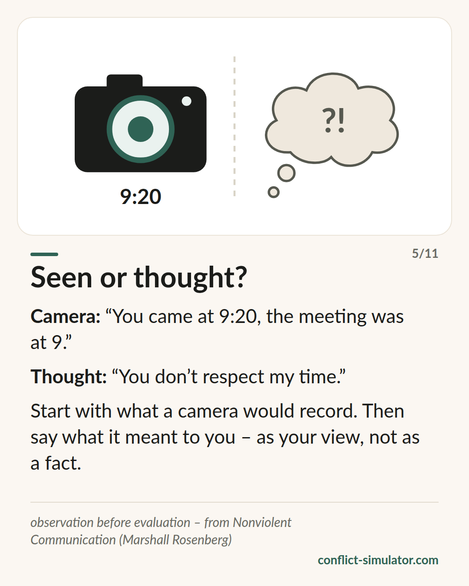

# Observe, do not evaluate

*A label invites a counter-example. What a camera would have recorded cannot be argued away.*

## What the model says

“You are unreliable” is an evaluation. “The input was due on Thursday and arrived on Friday” is an observation. Both mean the same incident — but only the second one the other person cannot deny, and only the second tells them what this is about.

Marshall Rosenberg put the separation of observation and evaluation at the start of his four steps: observe, feel, the need behind it, request. The observation is the step at which most conversations have already failed before they began.

The yardstick is the camera: what would a recording have caught? No intentions (“on purpose”), no patterns (“constantly”), no character (“disrespectful”). Only what happened — once, concrete, checkable.

## Where it comes from

Marshall B. Rosenberg, an American psychologist, “Nonviolent Communication: A Language of Life” (1999, 3rd edition 2015). The Conflict Simulator is based on the work of Marshall Rosenberg and the Center for Nonviolent Communication (cnvc.org); its author is not a CNVC-certified trainer.

The evidence is moderate: a systematic review (Juncadella 2013) found fourteen heterogeneous studies, mostly from education, too mixed for a meta-analysis. Single controlled trials show that training improves self-reported empathy. For the first step in particular: that evaluations trigger defence and concrete behaviour is more likely to land agrees with the feedback research — feedback aimed at the person rather than the task often makes performance worse (Kluger and DeNisi 1996).

**Evidence:** Partly supported, core consistent with feedback research

## What you can do with it before the conversation

### Let the camera run

Write the occasion down the way a recording would show it: when, what, who said what. If there is a word in the sentence the camera could not see, strike it.

### One incident instead of a pattern

“Always” and “constantly” cannot be checked and invite the counter-example. Take the one case that stands for the rest, and tell that one.

### Mark the interpretation as yours

You may say what it meant to you — as your view, not as a fact: “To me it looked as if the agreement did not matter to you.” Then the other person can set it straight without defending themselves.

## Where the Conflict Simulator uses it

The observation layer of the [wizard](https://conflict-simulator.com/en/start) is this step. Three rule groups watch over it — generalisations, labels, mind reading — each with its origin under the hint; all of them are on the page [All rules](https://conflict-simulator.com/en/rules). The proof field on the landing page checks the same layer on a single sentence before you have chosen anything.

The [card “Seen or thought?”](https://conflict-simulator.com/en/cards) puts camera and thought side by side. More on the [method](https://conflict-simulator.com/en/method) and on certified trainers at the [Center for Nonviolent Communication](https://www.cnvc.org).

## Limits

The camera does not see everything: an incident, cleanly observed, can still be part of a pattern that rightly worries you — then the pattern belongs in the conversation, just not in the first sentence. Whoever deletes every evaluation soon sounds like a protocol; the interpretation may come, marked as yours. And the four steps spoken as a formula are heard as a formula — Rosenberg himself warned against “NVC-speak”.

## Sources

- [Center for Nonviolent Communication](https://www.cnvc.org)
- [CNVC: What is NVC?](https://www.cnvc.org/learn/what-is-nvc)
- [Juncadella (2013): Systematic review of NVC training studies](https://sites.google.com/site/empathytraininglitreview/training-papers/juncadella-2013)
- [Kluger & DeNisi (1996): The effects of feedback interventions on performance. Psychological Bulletin 119(2)](https://doi.org/10.1037/0033-2909.119.2.254)

Page: https://conflict-simulator.com/en/background/observe-not-evaluate
