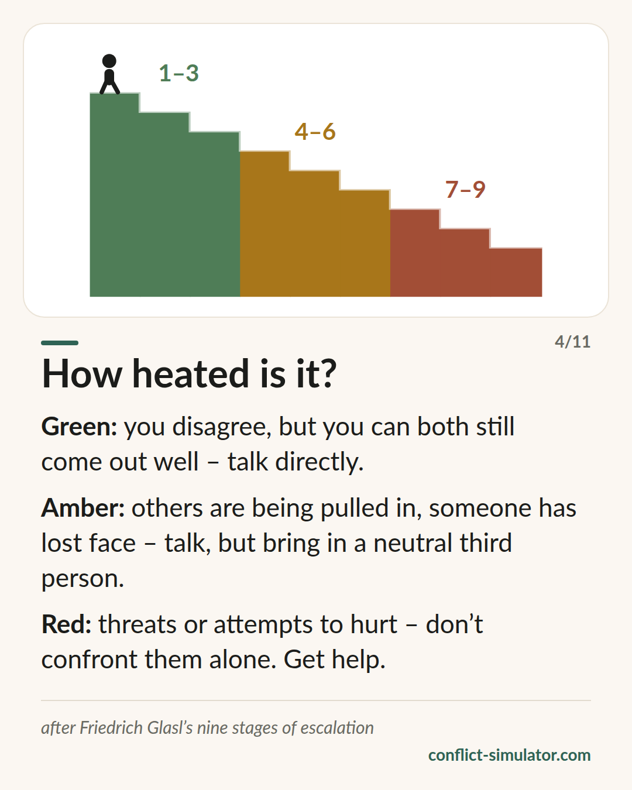

# Glasl's stages of escalation

*Nine stages, three phases — and the question whether you should still have this conversation on your own.*

## What the model says

Conflicts do not escalate at random; they go down in recognisable steps. Friedrich Glasl describes nine stages and draws them as a staircase leading downwards: with every step perception narrows and the number of ways out shrinks.

The first three stages — hardening, debate, actions instead of words — are still a dispute both sides can win. Stages four to six tip that over: people recruit allies, expose the other side, make threats. From stage seven on, the only aim left is to hurt the other side more than you lose yourself.

Glasl's advice is sober. Self-help carries you to about stage three, with luck to four. After that a third party is needed — moderation, mediation, eventually someone with the power to intervene.

## Where it comes from

Friedrich Glasl, an Austrian organisational consultant, published the model in 1980 in “Konfliktmanagement” (Haupt / Freies Geistesleben), a handbook for managers and consultants that has run through many editions. The short version “Selbsthilfe in Konflikten” (1998) addresses people in a conflict themselves.

The model is practice wisdom from consulting, not a tested scale: the order of the stages has not been validated psychometrically. It does match the broader research on escalation, for instance Pruitt and Kim, and forty years of mediation and organisational work have shown it to be a language in which people can talk about a conflict without pushing it further down.

**Evidence:** Practice wisdom, widely used, not validated

## What you can do with it before the conversation

### Ask four questions

Do you both still believe you can both win? Are others being pulled in? Has anyone lost face in front of others? Have there been threats? Every yes moves you one phase further.

### Let the phase pick the form

Green: talk directly. Amber: talk, but plan a neutral third person — a team lead, a trusted teacher, a mediator. Red: do not go into the confrontation alone.

### Do not take a step down yourself

Gathering allies, bringing up old stories, threatening consequences — each of these is itself a step down the staircase. Your first sentence decides whether you take it.

## Where the Conflict Simulator uses it

The first step of the [wizard](https://conflict-simulator.com/en/start) is the situation: five yes-or-no questions after Glasl's stages. The result sits on your conversation card as a green, amber or red band and decides what the wizard offers you.

The bands are deliberately drawn tighter than on the [card “How heated is it?”](https://conflict-simulator.com/en/cards), which shows Glasl's own split of 1–3, 4–6 and 7–9. The triage turns amber at stage four and red at stage six, at threats. The reason is safety: someone who has been threatened should not rehearse a conversation but see help and contacts first. The [rule on threats](https://conflict-simulator.com/en/rules) in the request layer draws the same line.

## Limits

The staircase tempts you to assign a stage to the other person — “he's already at six”. But Glasl describes relationships, not people; both sides always stand on the same stage. The placement is also a snapshot after five questions, not a diagnosis. Where there is violence or fear, the stage does not matter; the way to help does.

## Sources

- [Friedrich Glasl's model of conflict escalation (Wikipedia)](https://en.wikipedia.org/wiki/Friedrich_Glasl%27s_model_of_conflict_escalation)
- [Conflict analysis after Glasl — leaflet (FGW e. V., PDF, German)](https://win.fgw-ev.de/media/merkblatt_konfliktanalyse.pdf)
- [Trigon Entwicklungsberatung, co-founded by Glasl](https://www.trigon.at)

Page: https://conflict-simulator.com/en/background/glasl-escalation-stages
