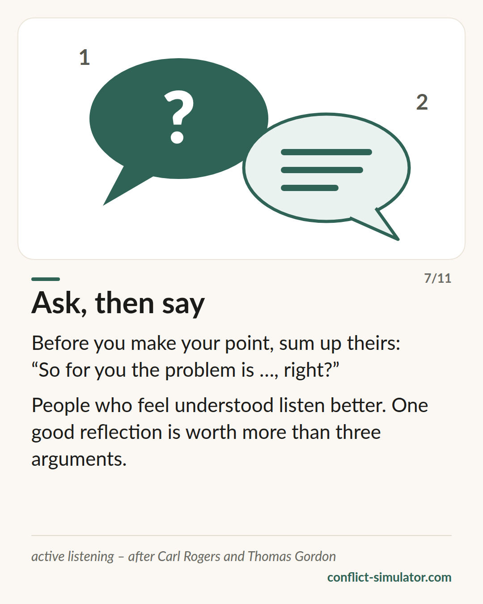

# I-messages

*“You make me angry” asserts a cause. “I get angry” describes what happens — and cannot be denied.*

## What the model says

A you-message tells the other person what is wrong with them. An I-message tells them what is happening with me. Thomas Gordon gave it three parts: the behaviour, without judgement (“when the dishes are still there in the morning”), its concrete effect on me (“I have to wash them before work”) and my feeling about it (“and I am annoyed”).

The first person alone is not enough. “I think you are unfair” begins with I and is a verdict. “I feel ignored” sounds like a feeling and is an interpretation of what the other person did. A real I-message names a feeling nobody can deny.

With Gordon the other half belongs to it: active listening. First reflect what you heard — then answer.

## Where it comes from

Thomas Gordon, a student of Carl Rogers, described the I-message in 1970 in “Parent Effectiveness Training”, later for schools and leadership. In Ruth Cohn's theme-centred interaction the rule reads “speak for yourself, say I, not one”.

The evidence is mixed and should be called that. Openings in the first person that also acknowledge the other side's view are rated the least hostile (Rogers, Howieson and Neame 2018). In real arguments between couples, on the other hand, I-statements alone did not reduce escalation — the form does not carry when contempt rides along. For active listening the picture is better: people who are reflected feel more understood than with advice or agreement (Weger et al. 2014).

**Evidence:** Partly supported — the form helps but does not replace the stance

## What you can do with it before the conversation

### Write down the three parts

Behaviour without judgement, effect on you, your feeling. Three lines. If there is a character word in the first, it is still a you-message in disguise.

### Check the feeling

Is that a feeling — angry, sad, unsure — or an interpretation: ignored, dismissed, not taken seriously? The interpretation says what the other person did. Look for the feeling underneath.

### Reflect the first answer

Prepare an opening: “So you are saying …”, “If I understand you right …”. People who feel understood listen better — and only then is your argument worth making.

## Where the Conflict Simulator uses it

The impact layer of the [wizard](https://conflict-simulator.com/en/start) is an I-message in Gordon's sense. Several [rules](https://conflict-simulator.com/en/rules) check it: you-messages are detected and, where the grammar allows it safely, rewritten; pseudo-I-messages and interpretations instead of feelings get a follow-up question; if there is no feeling word at all, the page says so. The rules on “everyone” and “one” follow Ruth Cohn.

After the result, “When they answer” asks for your listening line — that is active listening for the conversation card. The [card “Ask, then say”](https://conflict-simulator.com/en/cards) sums it up; in the [practice room](https://conflict-simulator.com/en/practise) you can practise reflecting with a counterpart.

## Limits

An I-message is not a spell. Spoken mechanically it is heard as a technique and answered as one; used on a person who threatens or despises, it gets the contempt back. Nor is it a formula for every situation: some concerns need a clear “stop that” and no feeling. And three parts does not mean three paragraphs — Gordon wanted one sentence, then listening.

## Sources

- [Gordon Training International: Origins of the Gordon Model](https://www.gordontraining.com/thomas-gordon/origins-of-the-gordon-model/)
- [Rogers, Howieson & Neame (2018): I understand you feel that way, but I feel this way. PeerJ 6:e4831](https://peerj.com/articles/4831/)
- [Weger, Castle Bell, Minei & Robinson (2014): The relative effectiveness of active listening. International Journal of Listening 28(1)](https://doi.org/10.1080/10904018.2013.813234)

Page: https://conflict-simulator.com/en/background/i-messages
