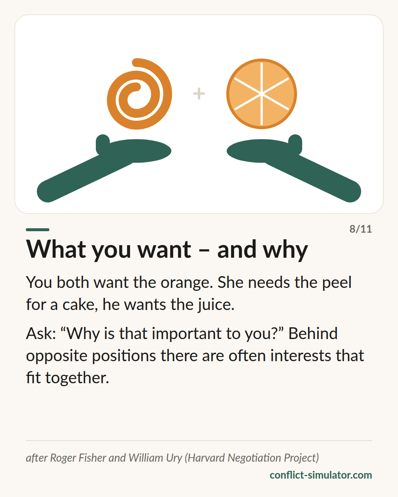

# Interests, not positions

*Behind what someone demands there is a reason — and two reasons often fit together better than two demands.*

## What the model says

Two people want the same orange. That is a position. She needs the peel for a cake, he wants the juice — those are interests, and they fit together. Roger Fisher and William Ury built a school of negotiation on that observation.

Their principles: separate the people from the problem — hard on the matter, soft on the people. Look at interests, not positions. Develop several options before settling on one. And insist on checkable standards instead of pressure.

Add to that the question of your best alternative: what do you do if you do not reach an agreement? Whoever knows that need neither cling nor cave.

## Where it comes from

Roger Fisher and William Ury, “Getting to Yes” (1981), from the second edition with Bruce Patton. It grew out of the Harvard Negotiation Project, which the authors founded in 1979. Ury's “Getting Past No” (1991) deals with difficult counterparts.

The core — negotiating over interests more often leads to solutions that serve both sides — is well supported in experimental negotiation research (for instance De Dreu, Weingart and Kwon 2000). The book as a package is practice wisdom with cultural limits: it assumes both sides can and want to talk openly about interests.

**Evidence:** Core well supported, the package practice wisdom

## What you can do with it before the conversation

### Ask “what for” twice

What do you want? And what for? What does the other person want — and what for? Two lines per side. Usually there is an interest behind both positions that does not exclude the other.

### Three options before you demand one

Whoever goes into the conversation with a single solution negotiates over yes or no. With three proposals that serve both interests, you negotiate over how.

### Know your alternative

What happens if you do not agree — and is that better or worse than what the other side is likely to offer? That question takes the edge off the fear.

## Where the Conflict Simulator uses it

In the step “The other side” of the [wizard](https://conflict-simulator.com/en/start) there are two lines: “What do they want?” and “And what for? What is behind it?” Your answer goes onto the conversation card under “The other side”. The agreement at the end — who, what, by when, when do we check — is the checkable standard from the same approach.

The [card “What you want — and what for”](https://conflict-simulator.com/en/cards) tells the orange on one page. In the [practice room](https://conflict-simulator.com/en/practise) the counterpart holds a position, and the coach asks what interest might be behind it.

## Limits

Not every conflict is a negotiation. Where it is about hurt, respect or trust, the search for “options” feels cold, and the relationship level goes unsaid. The approach also assumes a degree of equal footing; with a strong power imbalance or with threats its principles do not carry. And “hard on the matter” is heard as an attack on the person in some cultures.

## Sources

- [Program on Negotiation, Harvard Law School](https://www.pon.harvard.edu)
- [Getting to Yes — overview (Wikipedia)](https://en.wikipedia.org/wiki/Getting_to_Yes)
- [De Dreu, Weingart & Kwon (2000): Influence of social motives on integrative negotiation. JPSP 78(5)](https://doi.org/10.1037/0022-3514.78.5.889)

Page: https://conflict-simulator.com/en/background/interests-not-positions
