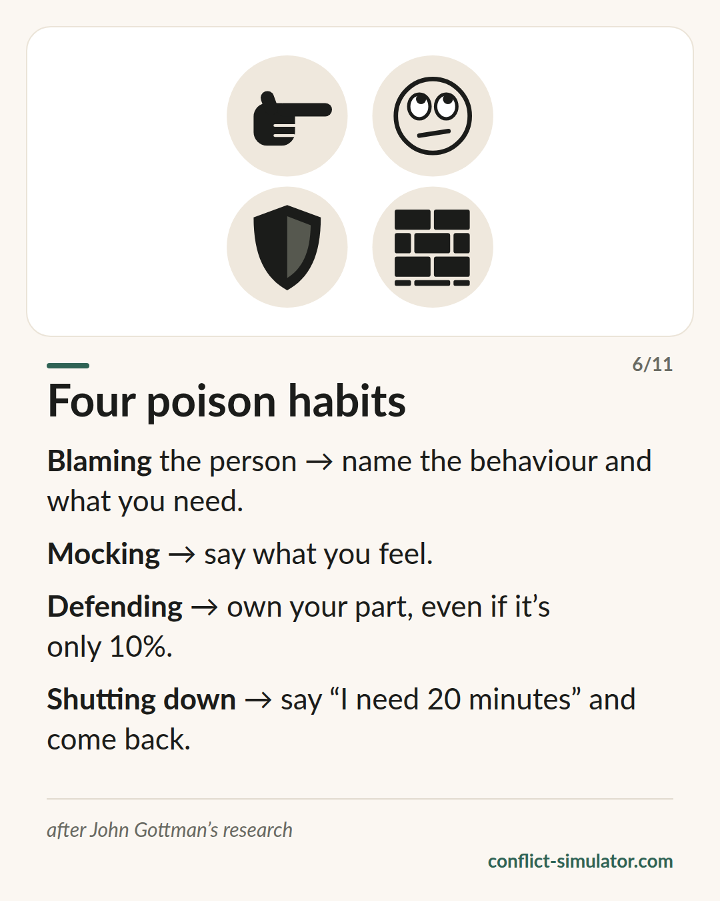

# Four poison habits

*Four patterns that reliably tip a conversation over — and an antidote for each.*

## What the model says

Over decades John Gottman filmed couples arguing and found four patterns that do particular damage. He calls them the four horsemen of the apocalypse; the card says it more plainly: four poison habits.

Criticism attacks the person instead of the behaviour (“you are so selfish”). Contempt puts yourself above the other person — mockery, eye-rolling, “yeah, right”. Defensiveness rejects any share of the blame. Stonewalling means shutting down and going silent, usually because you are flooded.

Each has an antidote: name the behaviour and say what you need; say your own feelings instead of mocking; take a part of the responsibility, even if it is only ten percent; call a break and come back. And: how a conversation begins in its first minutes shapes how it ends.

## Where it comes from

John Gottman, a psychologist at the University of Washington, with Robert Levenson and later Julie Gottman; books “What Predicts Divorce?” (1994) and “The Seven Principles for Making Marriage Work” (with Nan Silver, 1999). The study on the soft start-up: Carrère and Gottman, Family Process 1999.

The link between contempt, negative affect and poorer relationship outcomes is robust across many labs. What does not hold are the famous numbers: “91 percent prediction accuracy” or “96 percent from the first three minutes” came from small samples without cross-validation and did not survive re-examination (Heyman and Slep 2001). The antidotes themselves have hardly been tested as interventions; they are plausible practice, not a finding.

**Evidence:** Patterns well supported, prediction rates not, antidotes practice wisdom

## What you can do with it before the conversation

### Know your horseman

Which of the four is yours when things get tight? Most people have one. Knowing your own lets you spot it a second earlier in the conversation — and a second is often enough.

### Detoxify the opening

Strike every “always”, every character word and every barb from your first sentence. What remains is a behaviour, a feeling, a wish. That is the soft start-up.

### Keep a repair ready

One sentence to start over with when it tips: “That came out wrong, let me try again.” Repairs work when the other side accepts them — and that is more likely when the sentence was there beforehand.

## Where the Conflict Simulator uses it

Two of the simulator's rules carry Gottman's name: the [rule on contempt markers](https://conflict-simulator.com/en/rules) (“yeah right”, “of course”) runs on all three layers, and in the impact layer a rule catches the harsh start-up with its blame frame. Each shows its origin under the hint.

At the end of the [wizard](https://conflict-simulator.com/en/start) your if-then plan comes with a repair line “If it tips over” — that is Gottman's repair attempt. The [card “Four poison habits”](https://conflict-simulator.com/en/cards) puts patterns and antidotes side by side.

## Limits

The research comes from couples in a lab. For work and school the transfer is plausible for criticism, contempt and defensiveness, but untested. A conversation with all four horsemen neatly avoided can still fail, and one with a barb in it can succeed. And whoever quotes the numbers — “93 percent”, “in three minutes” — is spreading a myth.

## Sources

- [The Gottman Institute: The Four Horsemen](https://www.gottman.com/blog/the-four-horsemen-recognizing-criticism-contempt-defensiveness-and-stonewalling/)
- [Carrère & Gottman (1999): Predicting divorce from the first three minutes. Family Process 38(3)](https://doi.org/10.1111/j.1545-5300.1999.00293.x)
- [Heyman & Slep (2001): The hazards of predicting divorce without crossvalidation. Journal of Marriage and Family 63(2)](https://doi.org/10.1111/j.1741-3737.2001.00473.x)

Page: https://conflict-simulator.com/en/background/four-poison-habits
