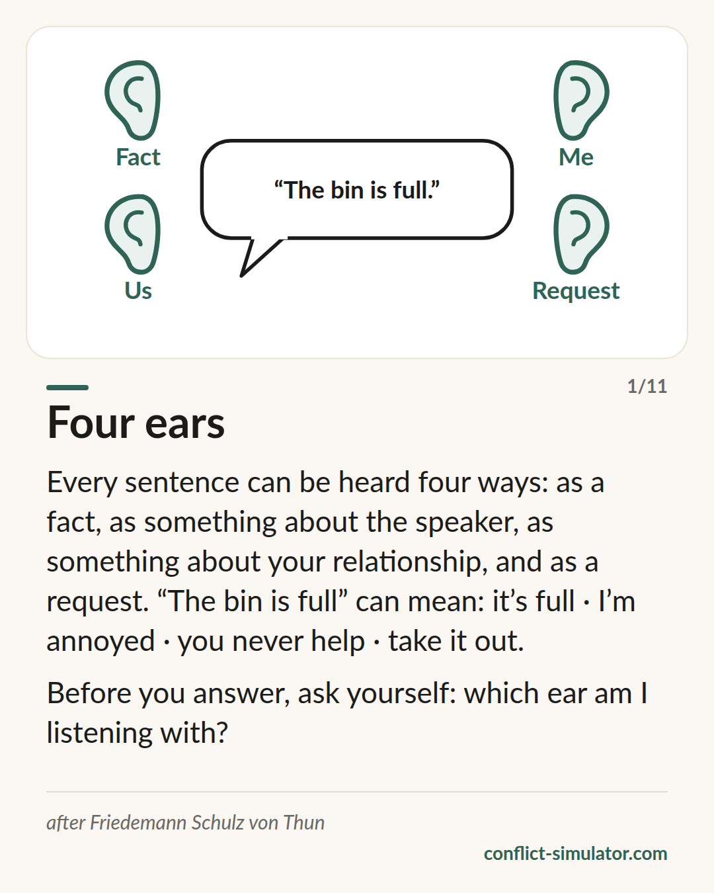

# Four ears

*Every message has four sides, and the person listening often hears a different one than you meant.*

## What the model says

A sentence like “The bin is full” carries four messages at once: a fact (the bin is full), something about the speaker (this bothers me), something about the relationship (I think this is your job) and an appeal (take it out). Friedemann Schulz von Thun calls this the communication square.

The point is in the listening. Whoever listens has four ears and decides, mostly without noticing, which one to use. One person hears the fact and says “true”. Another hears the relationship and says “so it is my fault again”. Both heard the same sentence.

Many conflicts do not start with what was said but with the ear the other side happened to have open — and with nobody asking.

## Where it comes from

Friedemann Schulz von Thun, a psychologist in Hamburg, presented the model in 1981 in “Miteinander reden 1” (Rowohlt). It builds on Watzlawick's distinction between content and relationship and on Bühler's organon model. In Germany it is on many school curricula and in the basic kit of every leadership course.

Empirically it is thin: a few reception studies, no experiment that tells four ears from three or five. Its strength is didactic — it gives people a vocabulary for talking about misunderstandings without accusing anyone of bad faith. As such it is practice wisdom, not a finding.

**Evidence:** Practice wisdom, didactically strong, barely tested

## What you can do with it before the conversation

### Read your opening sentence four ways

Write it down. What is the fact? What do you reveal about yourself? What does it say about your relationship? What should the other person do? The side you do not mean is often the loudest.

### Guess the likely ear

Which ear will the other person listen with — given everything that happened between you lately? If you fear “relationship”, say the relationship message yourself before it gets guessed.

### Say the self-revelation out loud

“This bothers me” is the side we prefer to leave out — and the one the other person then reads off our tone. Said out loud, it hurts less than guessed.

## Where the Conflict Simulator uses it

In the optional step “The other side” of the [wizard](https://conflict-simulator.com/en/start) your opening sentence sits at the top and the four ears below it: the simulator suggests what the other person probably hears on each side, and you correct it where you know better. The result goes onto your conversation card.

In the [practice room](https://conflict-simulator.com/en/practise) the other direction comes in: a counterpart answers, and after a round the coach asks which ear you were just listening with. The [card “Four ears”](https://conflict-simulator.com/en/cards) sums the model up on one page.

## Limits

The square explains misunderstandings but does not resolve them — it does not tell you which side is right. It also tempts you to accuse the other person of using “the wrong ear”; then a tool for understanding becomes one more reproach. And a sentence that really is hurtful on the relationship side does not get better by being declared “just a fact”.

## Sources

- [Schulz von Thun Institute: the models (German)](https://www.schulz-von-thun.de/die-modelle)
- [Four-sides model (Wikipedia)](https://en.wikipedia.org/wiki/Four-sides_model)
- [Vier-Seiten-Modell (Wikipedia, German)](https://de.wikipedia.org/wiki/Vier-Seiten-Modell)

Page: https://conflict-simulator.com/en/background/four-ears
