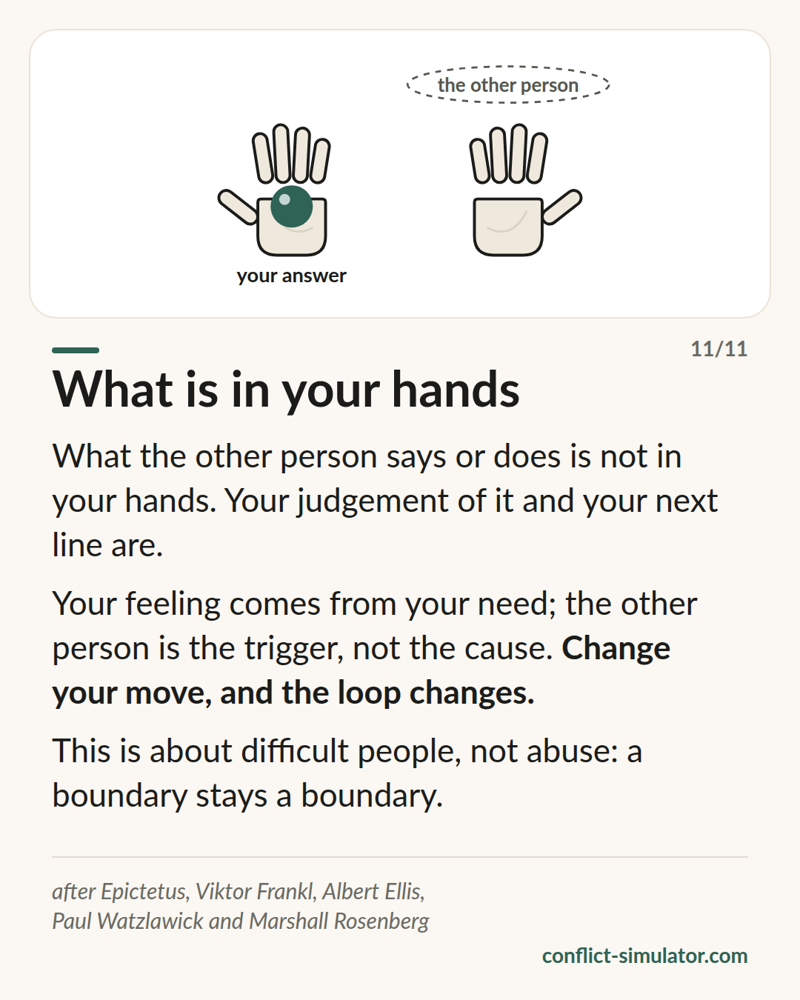

# What is in your hands

*What the other person says is not in your hands. Your judgement and your next line are — and with them the loop you are both in.*

## What the model says

“You make me angry” sounds like a description but is an attribution: it puts your feeling into the other person’s hands.

The distinction is old: what others do is not up to you. Your judgement, your feeling and your next line are. The feeling comes from your need; the other person is the trigger, not the cause.

And because an argument is a loop in which each side believes it is only reacting, one changed move changes the loop: the circle runs differently without your old move.

## Where it comes from

The oldest root lies before the Stoics. The Dhammapada opens with “mind precedes all things” (verses 1–2), and the Sallatha Sutta (SN 36.6) describes two arrows: the event is the first, the reaction we add the second. Between feeling-tone and reaction there is a gap; Vipassana practice sits there. The coach in the simulator does not teach control over reactions, only noticing them: “Which part of this is in your hands?” — then a breath, not a technique.

Epictetus, Enchiridion 1 and 5 (around 125 AD): some things are within our power, others are not; it is not things that disturb us but our judgements about them. Viktor Frankl described in 1946 (“Man’s Search for Meaning”) the last freedom, to choose one’s attitude — the often quoted “space between stimulus and response” is Stephen Covey’s paraphrase, not Frankl’s wording. Albert Ellis built the ABC model (event, belief, consequence) on this in the 1950s, the start of Rational Emotive and later Cognitive Behavioural Therapy. Niebuhr’s serenity prayer says the same in three lines. Paul Watzlawick showed in 1983 (“The Situation Is Hopeless, But Not Serious”) how we feed our own loop and, with circularity, why one move changes it.

The evidence is split. Reappraisal measurably dampens feelings: the meta-analysis by Webb, Miles and Sheeran (2012, 306 studies) finds medium effects, clearly stronger than for suppression. That a changed move changes the loop is practice wisdom from systemic therapy, not measured.

**Evidence:** Reappraisal well supported, the rest practice wisdom

## What you can do with it before the conversation

### Which part of this is in your hands?

Write down the sentence that annoys you. Two columns: left, what the other person does; right, what you make of it — judgement, feeling, next line. Only the right column is yours to change.

### Predict the other person’s move

Write down what they will probably say, and next to it your calm answer. An answer you already have, you need not invent under pressure.

### Reappraise the one sentence

Take the line that stings most (“You’re overreacting”). What second reading is there? “She wants it to be less.” You need not believe it, only know it.

## Where the Conflict Simulator uses it

The lens “What this is about for you” in the [assistant](https://conflict-simulator.com/en/start) asks for feeling and need. The [if-then](wenn-dann-plaene.md) step is the predicted move with your answer ready.

In the [practice room](https://conflict-simulator.com/en/practise) the coach asks in the time-out “Which part of this is in your hands?” and sends the [card “What is in your hands”](https://conflict-simulator.com/en/cards) when a line blames the other person for your feeling; the card “Who started it?” shows the loop.

## Limits

This is a stance towards difficult people, not a reason to accept abuse. Anyone threatened, humiliated or controlled has nothing to reappraise: the red level of the triage stays red, and some situations need a third person — a counselling service, a manager, the police.

## Sources

- [Epictetus: The Enchiridion (MIT Internet Classics Archive)](http://classics.mit.edu/Epictetus/epicench.html)
- [Sallatha Sutta, SN 36.6: The Arrow (Access to Insight)](https://www.accesstoinsight.org/tipitaka/sn/sn36/sn36.006.than.html)
- [Dhammapada 1–2: Mind precedes (Access to Insight)](https://www.accesstoinsight.org/tipitaka/kn/dhp/dhp.01.than.html)
- [Webb, Miles & Sheeran (2012): Dealing with feeling. A meta-analysis of emotion regulation strategies. Psychological Bulletin 138(4)](https://doi.org/10.1037/a0027600)

Page: https://conflict-simulator.com/en/background/what-is-in-your-hands
