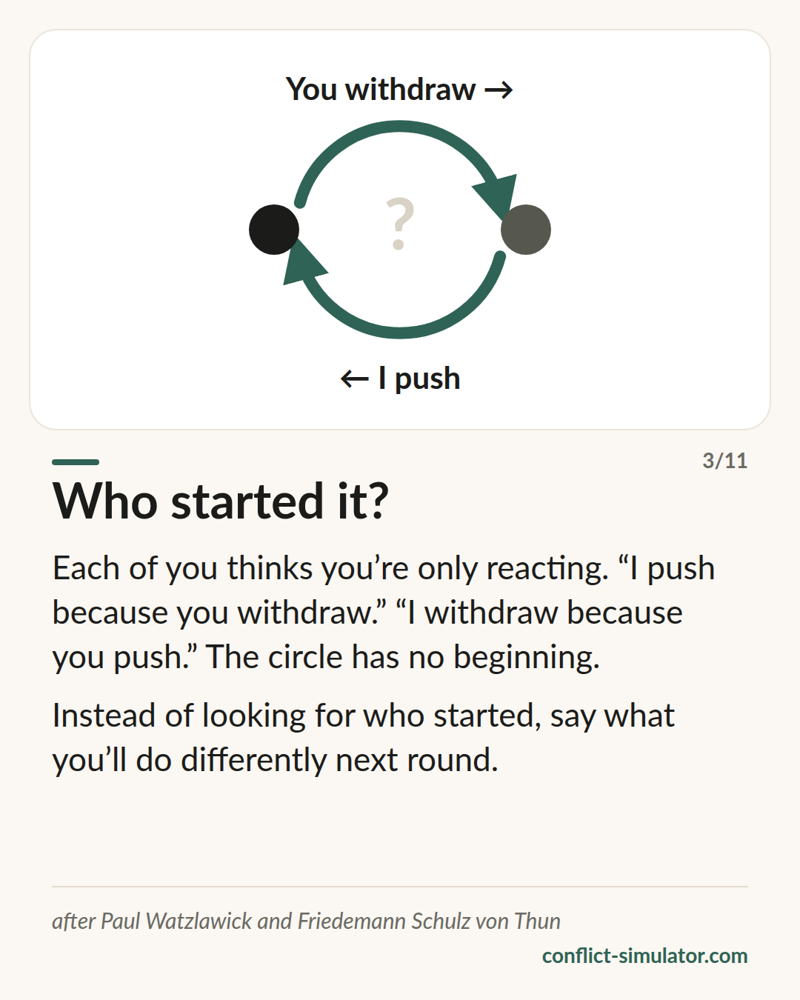

# Watzlawick's axioms

*One cannot not communicate — and three more sentences that explain a row before it begins.*

## What the model says

In 1967 Paul Watzlawick and his colleagues set out five “tentative axioms” of communication. Three of them are worth having before a difficult conversation.

First: every message has a content and a relationship aspect, and the relationship aspect decides how the content is understood. A fight about the dishes is rarely a fight about the dishes.

Second: how a relationship is experienced depends on punctuation — on where each side places the beginning. “I push because you withdraw.” “I withdraw because you push.” Both are right; the loop has no start.

Third: we communicate digitally, in words, and analogically, in tone, pace and face. The words carry the content, the analogue carries the relationship. When the two do not match, the other person believes the analogue.

## Where it comes from

Paul Watzlawick, Janet Beavin and Don D. Jackson, “Pragmatics of Human Communication”, Norton 1967. The authors belonged to the Palo Alto group around Gregory Bateson and worked in family therapy.

The axioms are a heuristic, not a theory with predictions: they are hard to test, and the authors themselves called them tentative. Their influence on family therapy and communication studies is enormous, their empirical testing thin. For preparing a conversation they count as practice wisdom — useful as a lens, not as proof.

**Evidence:** Practice wisdom, influential, hard to test

## What you can do with it before the conversation

### Say the relationship level out loud

Say what this is about besides the matter itself: “It is about the dishes — and about whether I matter to you.” What is said does not have to be guessed from your tone.

### Write the loop down

Two lines: “I … because you …” and “You … because I …”. Whoever sees the loop stops looking for the start and starts looking for the place where they can step out of it.

### Match words and tone

If you are hurt and announce “just a remark”, the other person hears the hurt anyway — and reacts to it, not to the remark. Say what is.

## Where the Conflict Simulator uses it

In the step “The other side” of the [wizard](https://conflict-simulator.com/en/start) you fill in the vicious circle in two lines; it then sits on your conversation card. The idea of separating content from relationship also sits inside the three layers observation, impact and request — the impact is the relationship level, said out loud.

Two [cards](https://conflict-simulator.com/en/cards) carry the model: “Content and relationship” and “Who started?”. In the [practice room](https://conflict-simulator.com/en/practise) the coach notices when both sides are fighting for the last word.

## Limits

The loop can blur responsibility: where violence, threats or a clear imbalance of power are involved there is a beginning, and naming it is not punctuation but necessary. And “one cannot not communicate” does not license reading everything as a message — silence has many reasons, which you have to ask about rather than decode. The often quoted rule that communication is 93 percent nonverbal is not Watzlawick and is wrong.

## Sources

- [Watzlawick, Beavin, Jackson: Some Tentative Axioms of Communication (1967, chapter as PDF)](https://www.neoscenes.net/teach/cu/2012_2/atls2000_mit/pdfs/Watzlawick-1967-Some_Tentative_Axioms_of_Communication.pdf)
- [Paul Watzlawick (Wikipedia)](https://en.wikipedia.org/wiki/Paul_Watzlawick)
- [Mental Research Institute, Palo Alto](https://mri.org)

Page: https://conflict-simulator.com/en/background/watzlawick-axioms
