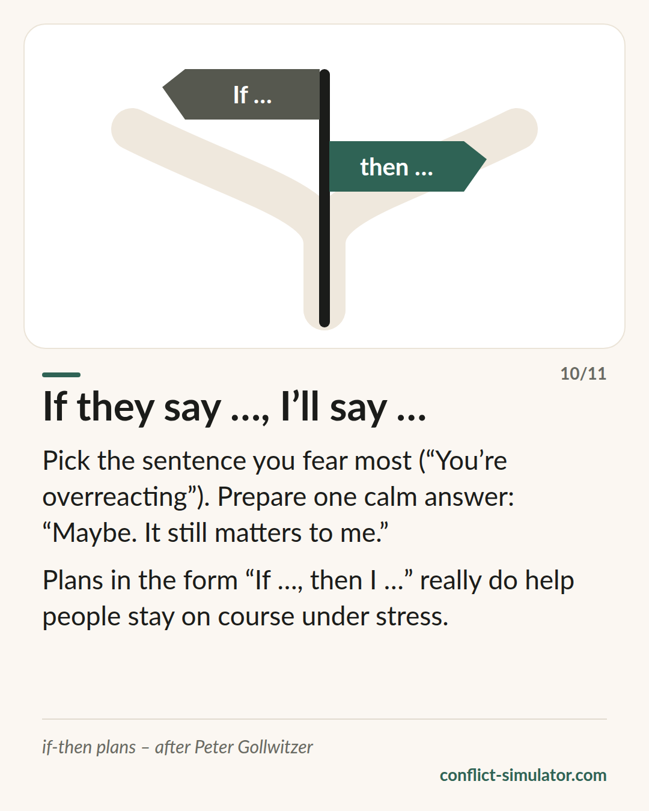

# If-then plans

*One prepared sentence for the moment you fear most — the best-supported tool on this site.*

## What the model says

Having a goal (“I will stay calm”) helps little when the moment comes. A plan of the form “If X happens, then I do Y” helps a lot more. Peter Gollwitzer calls this an implementation intention; most people say if-then plan.

The mechanism: the if-condition becomes a cue you recognise almost automatically in the conversation, and the then-action is already waiting. In the hot second you do not have to decide, only to recall.

For a difficult conversation that means: pick the sentence you dread — “You are overreacting”, “Here we go again” — and prepare one calm answer. “Maybe. It still matters to me.”

## Where it comes from

Peter Gollwitzer, a social psychologist (Konstanz, New York), published the concept in 1999 in the American Psychologist: “Implementation intentions: Strong effects of simple plans”. The meta-analysis by Gollwitzer and Sheeran (2006) pools 94 studies and finds a medium to large effect on reaching goals (d ≈ .65).

For a tool in conversation preparation that is unusually well supported: randomised experiments, many domains, stable results. Gabriele Oettingen turned it into the four-step exercise “WOOP” (wish, outcome, obstacle, plan), which has been tested too. What is shown is the effect on your own behaviour under pressure — not that the conversation ends well because of it.

**Evidence:** Well supported — meta-analysis of 94 studies

## What you can do with it before the conversation

### Pick the sentence you fear

Not ten sentences, one. Which objection do you expect, and which one would most likely throw you? That is your if.

### An answer that does not hit back

The then should be short, in the first person and without a counter-attack: “Could be. I still want to talk about it.” Say it out loud twice so it sits in your mouth.

### Add a break rule

A second plan in case it tips over: “If I notice I am getting loud, then I say: I need twenty minutes, and I will come back.”

## Where the Conflict Simulator uses it

At the end of the [wizard](https://conflict-simulator.com/en/start), “If they say …” asks for exactly this sentence: you pick from typical pushback, get a calm answer to go with it, and a line for the case that it tips over anyway. Both go onto the conversation card, the if-then plan also into the copied text.

The [card “If they say …, I'll say …”](https://conflict-simulator.com/en/cards) is the short version; in the [practice room](https://conflict-simulator.com/en/practise) you can try the line against a counterpart that really does push back.

## Limits

A plan does not make a bad sentence good: whoever resolves “If she disagrees, then I tell her she never understands anything” will reliably do so. The plan works on your behaviour, not on the other person's — and it does not carry once the conversation has reached threats. Too many plans make you stiff; one is enough.

## Sources

- [Gollwitzer (1999): Implementation intentions. American Psychologist 54(7)](https://doi.org/10.1037/0003-066X.54.7.493)
- [Gollwitzer & Sheeran (2006): meta-analysis, Advances in Experimental Social Psychology 38](https://doi.org/10.1016/S0065-2601(06)38002-1)
- [Gabriele Oettingen: WOOP](https://woopmylife.org)

Page: https://conflict-simulator.com/en/background/if-then-plans
