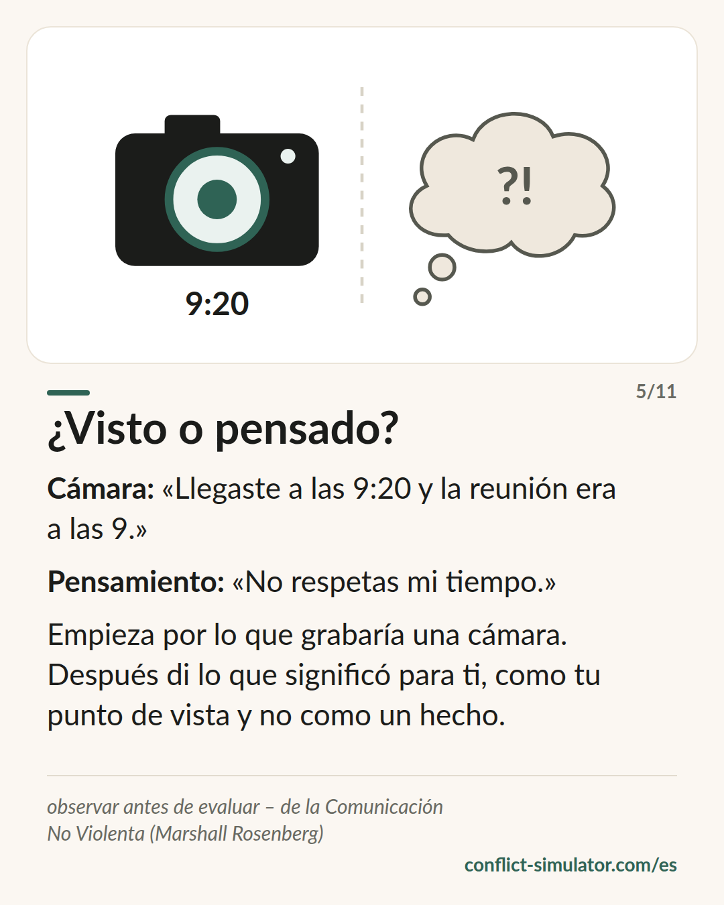

# Observar sin evaluar

*Una etiqueta invita al contraejemplo. Lo que habría grabado una cámara no se puede discutir.*

## Qué dice el modelo

«Eres un irresponsable» es una evaluación. «Tu parte estaba prevista para el jueves y llegó el viernes» es una observación. Las dos hablan del mismo hecho, pero solo la segunda es innegable para el otro, y solo la segunda le dice de qué va esto.

Marshall Rosenberg puso la separación entre observación y evaluación al principio de sus cuatro pasos: observar, sentir, la necesidad que hay detrás, pedir. La observación es el paso en el que la mayoría de las conversaciones ya han fracasado antes de empezar.

La medida es la cámara: ¿qué habría recogido una grabación? Ninguna intención («a propósito»), ningún patrón («todo el rato»), ningún rasgo («irrespetuoso»). Solo lo que pasó: una vez, concreto, comprobable.

## De dónde viene

Marshall B. Rosenberg, psicólogo estadounidense, «Nonviolent Communication: A Language of Life» (1999, 3.ª edición 2015; en español, «Comunicación no violenta»). El Simulador de Conflictos se basa en el trabajo de Marshall Rosenberg y del Center for Nonviolent Communication (cnvc.org); su autor no es un formador certificado por el CNVC.

La evidencia es media: una revisión sistemática (Juncadella 2013) encontró catorce estudios heterogéneos, la mayoría del ámbito educativo, demasiado dispares para un metaanálisis. Algunos ensayos controlados muestran que la formación mejora la empatía autoinformada. Para el primer paso en concreto: que las evaluaciones disparen la defensa y que la conducta concreta llegue mejor coincide con la investigación sobre feedback, donde el feedback dirigido a la persona en vez de a la tarea empeora a menudo el rendimiento (Kluger y DeNisi 1996).

**Respaldo:** Respaldo parcial; el núcleo coincide con la investigación sobre feedback

## Qué puedes hacer con él antes de la conversación

### Deja la cámara grabando

Escribe el hecho tal como lo mostraría una grabación: cuándo, qué, quién dijo qué. Si en la frase hay una palabra que la cámara no puede ver, táchala.

### Un hecho en lugar de un patrón

«Siempre» y «todo el rato» no se pueden comprobar e invitan al contraejemplo. Toma el caso que para ti representa a los demás y cuenta ese.

### Marca la interpretación como tuya

Lo que significó para ti puedes decirlo, como tu punto de vista y no como un hecho: «A mí me pareció que el acuerdo no te importaba». Así el otro puede aclararlo sin defenderse.

## Dónde lo usa el Simulador de Conflictos

La capa del hecho del [asistente](https://conflict-simulator.com/es/empezar) es este paso. Tres grupos de reglas lo vigilan —generalizaciones, etiquetas, leer la mente—, cada uno con su origen bajo la pista; todos están en la página [Todas las reglas](https://conflict-simulator.com/es/reglas). El campo de prueba de la portada revisa la misma capa con una sola frase, antes de que elijas nada.

La [tarjeta «¿Visto o pensado?»](https://conflict-simulator.com/es/tarjetas) pone cámara y pensamiento uno al lado del otro. Más sobre el [método](https://conflict-simulator.com/es/metodo) y sobre formadores certificados en el [Center for Nonviolent Communication](https://www.cnvc.org) y en la [Asociación para la Comunicación NoViolenta de España](https://www.asociacioncomunicacionnoviolenta.org).

## Límites

La cámara no lo ve todo: un hecho bien observado puede ser igualmente parte de un patrón que te preocupa con razón; entonces el patrón va en la conversación, solo que no en la primera frase. Quien borra toda evaluación acaba sonando a acta; la interpretación puede venir, marcada como tuya. Y los cuatro pasos dichos como fórmula se oyen como fórmula: el propio Rosenberg advirtió contra hablar «en CNV».

## Fuentes

- [Center for Nonviolent Communication](https://www.cnvc.org)
- [Asociación para la Comunicación NoViolenta de España (ACNV)](https://www.asociacioncomunicacionnoviolenta.org)
- [Juncadella (2013): revisión sistemática de estudios sobre formación en CNV](https://sites.google.com/site/empathytraininglitreview/training-papers/juncadella-2013)
- [Kluger y DeNisi (1996): The effects of feedback interventions on performance. Psychological Bulletin 119(2)](https://doi.org/10.1037/0033-2909.119.2.254)

Página: https://conflict-simulator.com/es/fondo/observar-sin-evaluar
