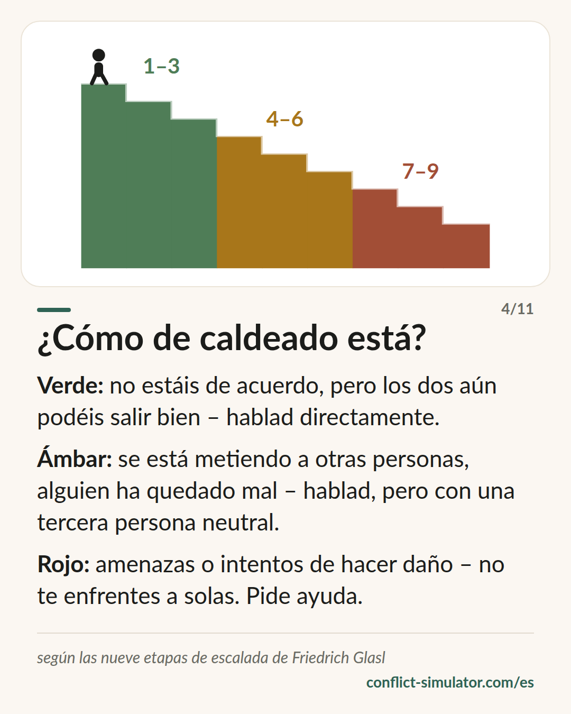

# Etapas de escalada según Glasl

*Nueve etapas, tres fases, y una pregunta: ¿deberías tener esta conversación tú solo?*

## Qué dice el modelo

Los conflictos no se calientan al azar: bajan por escalones reconocibles. Friedrich Glasl describe nueve etapas y las dibuja como una escalera que baja. Con cada escalón la mirada se estrecha y quedan menos salidas.

Las tres primeras etapas —endurecimiento, debate, hechos en lugar de palabras— siguen siendo una disputa en la que los dos pueden ganar. De la cuatro a la seis la cosa cambia: se buscan aliados, se deja en evidencia al otro, se amenaza. A partir de la siete ya solo se trata de hacer más daño al otro del que uno mismo sufre.

El consejo de Glasl es sobrio: la autoayuda llega más o menos hasta la etapa tres, con suerte hasta la cuatro. Después hace falta una tercera persona: moderación, mediación y, al final, alguien con poder para intervenir.

## De dónde viene

Friedrich Glasl, consultor organizacional austriaco, publicó el modelo en 1980 en «Konfliktmanagement» (Haupt / Freies Geistesleben), un manual para directivos y asesores que lleva muchas ediciones. La versión breve «Selbsthilfe in Konflikten» (1998) se dirige a las propias personas en conflicto.

El modelo es saber práctico nacido de la consultoría, no una escala validada: el orden de las etapas no se ha comprobado psicométricamente. Encaja bien, eso sí, con la investigación sobre escalada (por ejemplo Pruitt y Kim), y cuarenta años de mediación y consultoría lo han convertido en un lenguaje con el que hablar de un conflicto sin empujarlo más abajo.

**Respaldo:** Saber práctico, muy usado, no validado

## Qué puedes hacer con él antes de la conversación

### Hazte cuatro preguntas

¿Los dos seguís creyendo que los dos podéis ganar? ¿Están entrando otras personas? ¿Alguien ha quedado mal delante de otros? ¿Ha habido amenazas? Cada sí te mueve una fase.

### Que la fase decida la forma

Verde: hablad directamente. Ámbar: hablad, pero con una tercera persona neutral prevista (un responsable de equipo, un tutor de confianza, mediación). Rojo: no entres solo en la confrontación.

### No bajes tú un escalón

Reunir aliados, sacar historias viejas, amenazar con consecuencias: cada uno de esos movimientos es un escalón hacia abajo. Tu primera frase decide si lo das.

## Dónde lo usa el Simulador de Conflictos

El primer paso del [asistente](https://conflict-simulator.com/es/empezar) es la situación: cinco preguntas de sí o no según las etapas de Glasl. El resultado aparece en tu tarjeta de conversación como una franja verde, ámbar o roja, y decide qué te ofrece el asistente.

Las franjas están aquí deliberadamente más ajustadas que en la [tarjeta «¿Cómo de caldeado está?»](https://conflict-simulator.com/es/tarjetas), que muestra el reparto del propio Glasl: 1–3, 4–6, 7–9. La situación pasa a ámbar ya en la etapa cuatro y a rojo en la seis, con las amenazas. El motivo es la seguridad: quien ha sido amenazado no debería ensayar una conversación, sino ver primero ayuda y contactos. La [regla sobre amenazas](https://conflict-simulator.com/es/reglas) de la capa de la petición traza la misma línea.

## Límites

La escalera invita a asignarle una etapa al otro: «ese ya está en la seis». Pero Glasl describe relaciones, no personas; en un escalón siempre están los dos. Además, la clasificación es una foto tras cinco preguntas, no un diagnóstico. Cuando hay violencia o miedo no cuenta la etapa, sino el camino hacia la ayuda.

## Fuentes

- [Modelo de escalada del conflicto de Friedrich Glasl (Wikipedia, inglés)](https://en.wikipedia.org/wiki/Friedrich_Glasl%27s_model_of_conflict_escalation)
- [Hoja de análisis de conflictos según Glasl (FGW e. V., PDF, alemán)](https://win.fgw-ev.de/media/merkblatt_konfliktanalyse.pdf)
- [Trigon Entwicklungsberatung, cofundada por Glasl](https://www.trigon.at)

Página: https://conflict-simulator.com/es/fondo/etapas-de-escalada-glasl
