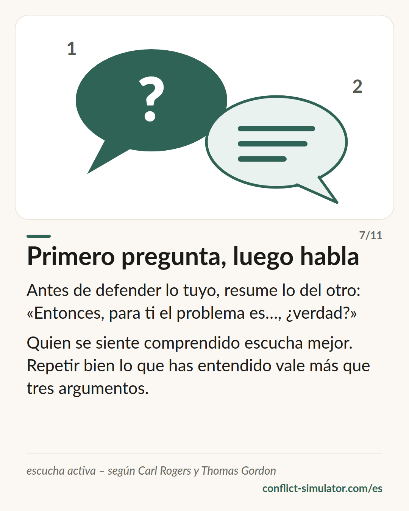

# Mensajes en primera persona

*«Me pones de los nervios» afirma una causa. «Me pongo de los nervios» describe lo que pasa, y no se puede negar.*

## Qué dice el modelo

Un reproche le dice al otro qué falla en él. Un mensaje en primera persona dice qué me pasa a mí. Thomas Gordon le dio tres partes: la conducta, sin juicio («cuando los platos siguen ahí por la mañana»), su efecto concreto en mí («tengo que lavarlos antes de ir a trabajar») y lo que siento («y me enfado»).

La primera persona sola no basta. «Creo que eres injusto» empieza por «creo» y es un veredicto. «Me siento ignorado» suena a sentimiento y es una interpretación de lo que hizo el otro. Un mensaje en primera persona de verdad nombra un sentimiento que nadie puede negar.

En Gordon viene con su otra mitad: la escucha activa. Primero devuelve lo que has oído; después responde.

## De dónde viene

Thomas Gordon, alumno de Carl Rogers, describió el mensaje en primera persona en 1970 en «Parent Effectiveness Training» (en español, «P.E.T. Padres eficaz y técnicamente preparados»), y después para la escuela y la dirección de equipos. En la interacción centrada en el tema de Ruth Cohn la regla dice «habla en primera persona, no con un “uno” o un “todos”».

La evidencia es mixta, y hay que decirlo así. Las frases de arranque en primera persona que además reconocen la visión del otro se valoran como las menos hostiles (Rogers, Howieson y Neame 2018). En discusiones reales de pareja, en cambio, los mensajes en primera persona por sí solos no redujeron la escalada: la forma no aguanta cuando va cargada de desprecio. Para la escucha activa el panorama es mejor: quien se ve reflejado se siente más comprendido que con un consejo o un «tienes razón» (Weger et al. 2014).

**Respaldo:** Respaldo parcial: la forma ayuda, pero no sustituye a la actitud

## Qué puedes hacer con él antes de la conversación

### Escribe las tres partes

Conducta sin juicio, efecto en ti, tu sentimiento. Tres líneas. Si en la primera hay un adjetivo sobre la persona, sigue siendo un reproche disfrazado.

### Revisa el sentimiento

¿Eso es un sentimiento (rabia, tristeza, inseguridad) o una interpretación (ignorado, despreciado, no tomado en serio)? La interpretación dice qué hizo el otro. Busca el sentimiento que hay debajo.

### Refleja la primera respuesta

Prepara un arranque: «O sea que…», «Si te he entendido bien…». Quien se siente comprendido escucha mejor, y solo entonces merece la pena tu argumento.

## Dónde lo usa el Simulador de Conflictos

La capa del sentimiento del [asistente](https://conflict-simulator.com/es/empezar) es un mensaje en primera persona en el sentido de Gordon. Varias [reglas](https://conflict-simulator.com/es/reglas) la revisan: los reproches se detectan y, donde la gramática lo permite con seguridad, se reescriben; los falsos mensajes en primera persona y las interpretaciones en lugar de sentimientos reciben una pregunta; si no hay ninguna palabra de sentimiento, la página lo dice. Las reglas sobre «todo el mundo» y «uno» siguen a Ruth Cohn.

Tras el resultado, «Cuando la otra persona responde» te pide tu frase de escucha: eso es escucha activa para la tarjeta de conversación. La [tarjeta «Primero pregunta, luego habla»](https://conflict-simulator.com/es/tarjetas) lo resume; en la [sala de práctica](https://conflict-simulator.com/es/practicar) puedes ensayar el reflejo con un interlocutor.

## Límites

Un mensaje en primera persona no es un conjuro. Dicho de forma mecánica se oye como técnica y se responde como tal; usado con alguien que amenaza o desprecia, devuelve el desprecio. Tampoco es una fórmula para toda situación: algunos asuntos necesitan un «para ya» claro y ningún sentimiento. Y tres partes no son tres párrafos: Gordon quería una frase, y después escuchar.

## Fuentes

- [Gordon Training International: Origins of the Gordon Model](https://www.gordontraining.com/thomas-gordon/origins-of-the-gordon-model/)
- [Rogers, Howieson y Neame (2018): I understand you feel that way, but I feel this way. PeerJ 6:e4831](https://peerj.com/articles/4831/)
- [Weger, Castle Bell, Minei y Robinson (2014): The relative effectiveness of active listening. International Journal of Listening 28(1)](https://doi.org/10.1080/10904018.2013.813234)

Página: https://conflict-simulator.com/es/fondo/mensajes-en-primera-persona
