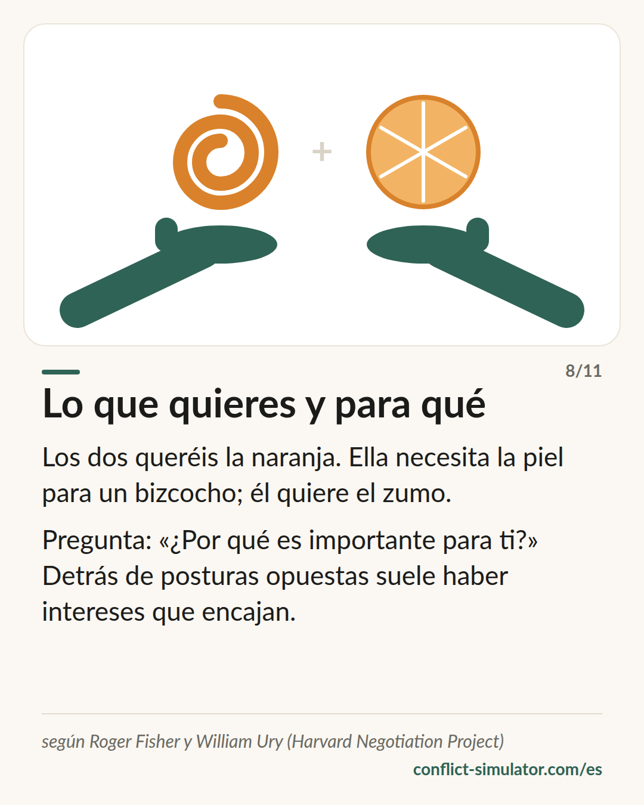

# Intereses, no posiciones

*Detrás de lo que alguien exige hay un motivo, y dos motivos suelen encajar mejor que dos exigencias.*

## Qué dice el modelo

Dos personas quieren la misma naranja. Eso es una posición. Ella necesita la piel para un bizcocho; él quiere el zumo: eso son intereses, y encajan. Roger Fisher y William Ury levantaron una escuela de negociación sobre esa observación.

Sus principios: separar a las personas del problema (duro con el asunto, suave con las personas). Mirar los intereses, no las posiciones. Generar varias opciones antes de decidirse por una. E insistir en criterios comprobables en lugar de en la presión.

A eso se suma la pregunta por tu mejor alternativa: ¿qué haces si no llegáis a un acuerdo? Quien lo sabe no necesita ni aferrarse ni ceder.

## De dónde viene

Roger Fisher y William Ury, «Getting to Yes» (1981), desde la segunda edición con Bruce Patton; en español, «Obtenga el sí». Nació en el Harvard Negotiation Project, que los autores fundaron en 1979. «Supere el no», de Ury (1991), trata con interlocutores difíciles.

El núcleo —negociar sobre intereses lleva más a menudo a soluciones que sirven a los dos— está bien respaldado por la investigación experimental sobre negociación (por ejemplo De Dreu, Weingart y Kwon 2000). El libro como paquete es saber práctico con límites culturales: da por hecho que las dos partes pueden y quieren hablar abiertamente de sus intereses.

**Respaldo:** Núcleo bien respaldado; el paquete, saber práctico

## Qué puedes hacer con él antes de la conversación

### Pregunta «para qué» dos veces

¿Qué quieres? ¿Y para qué? ¿Qué quiere la otra persona, y para qué? Dos líneas por lado. Casi siempre hay detrás de las dos posiciones un interés que no excluye al otro.

### Tres opciones antes de exigir una

Quien entra en la conversación con una sola solución negocia un sí o un no. Con tres propuestas que sirvan a los dos intereses, negociáis el cómo.

### Conoce tu alternativa

¿Qué pasa si no os ponéis de acuerdo, y es eso mejor o peor que lo que el otro probablemente ofrezca? Esa pregunta le quita filo al miedo.

## Dónde lo usa el Simulador de Conflictos

En el paso «El otro lado» del [asistente](https://conflict-simulator.com/es/empezar) hay dos líneas: «¿Qué quiere?» y «¿Y para qué? ¿Qué hay detrás?». Tu respuesta va a la tarjeta de conversación bajo «El otro lado». El acuerdo del final —quién, qué, para cuándo, cuándo lo revisamos— es el criterio comprobable del mismo método.

La [tarjeta «Lo que quieres y para qué»](https://conflict-simulator.com/es/tarjetas) cuenta la naranja en una página. En la [sala de práctica](https://conflict-simulator.com/es/practicar) el interlocutor sostiene una posición y el coach pregunta qué interés podría haber detrás.

## Límites

No todo conflicto es una negociación. Donde se trata de daño, respeto o confianza, buscar «opciones» resulta frío y el nivel de la relación se queda sin decir. El método también presupone cierta igualdad; con un fuerte desnivel de poder o con amenazas sus principios no aguantan. Y «duro con el asunto» se oye en algunas culturas como un ataque a la persona.

## Fuentes

- [Program on Negotiation, Harvard Law School](https://www.pon.harvard.edu)
- [Getting to Yes — resumen (Wikipedia, inglés)](https://en.wikipedia.org/wiki/Getting_to_Yes)
- [De Dreu, Weingart y Kwon (2000): Influence of social motives on integrative negotiation. JPSP 78(5)](https://doi.org/10.1037/0022-3514.78.5.889)

Página: https://conflict-simulator.com/es/fondo/intereses-no-posiciones
