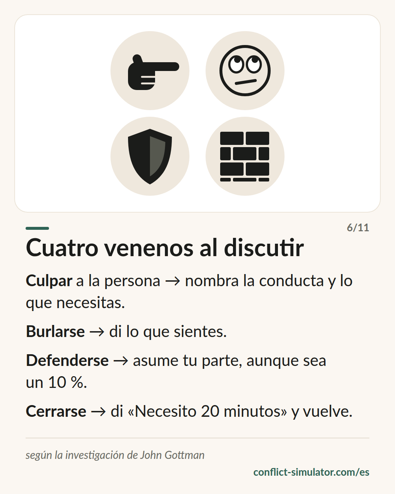

# Cuatro venenos al discutir

*Cuatro patrones que tumban una conversación con toda fiabilidad, y un antídoto para cada uno.*

## Qué dice el modelo

John Gottman grabó durante décadas a parejas discutiendo y encontró cuatro patrones que hacen especial daño. Él los llama los cuatro jinetes del Apocalipsis; la tarjeta lo dice más llano: cuatro venenos.

Culpar ataca a la persona en vez de a la conducta («eres un egoísta»). El desprecio se pone por encima del otro: burla, ojos en blanco, «claro que sí». Defenderse rechaza cualquier parte de responsabilidad. Cerrarse es apagarse y callar, casi siempre porque uno está desbordado.

Cada uno tiene su antídoto: nombra la conducta y di qué necesitas; di tus sentimientos en vez de burlarte; asume una parte de la responsabilidad, aunque sea un diez por ciento; pide una pausa y vuelve. Y: cómo empieza una conversación en sus primeros minutos marca cómo termina.

## De dónde viene

John Gottman, psicólogo de la Universidad de Washington, con Robert Levenson y más tarde Julie Gottman; libros «What Predicts Divorce?» (1994) y «Siete reglas de oro para vivir en pareja» (con Nan Silver, 1999). El estudio sobre el arranque suave: Carrère y Gottman, Family Process 1999.

La relación entre desprecio, afecto negativo y peor evolución de la pareja es sólida en muchos laboratorios. Lo que no se sostiene son las cifras famosas: «91 % de acierto» o «96 % con los tres primeros minutos» salieron de muestras pequeñas sin validación cruzada y no resistieron la revisión (Heyman y Slep 2001). Los antídotos apenas se han probado como intervención; son práctica plausible, no un hallazgo.

**Respaldo:** Patrones bien respaldados; porcentajes no; antídotos, saber práctico

## Qué puedes hacer con él antes de la conversación

### Conoce a tu jinete

¿Cuál de los cuatro es el tuyo cuando la cosa se tensa? Casi todo el mundo tiene uno. Conocer el propio te permite verlo un segundo antes en la conversación, y ese segundo suele bastar.

### Desintoxica el arranque

Quita de tu primera frase cada «siempre», cada adjetivo sobre la persona y cada pulla. Lo que queda es una conducta, un sentimiento, un deseo. Eso es el arranque suave.

### Ten una reparación a mano

Una frase para volver a empezar cuando se tuerce: «Eso ha salido mal, lo intento otra vez». Las reparaciones funcionan cuando el otro las acepta, y eso es más probable si la frase estaba antes.

## Dónde lo usa el Simulador de Conflictos

Tres reglas del simulador llevan el nombre de Gottman: la [regla sobre marcas de desprecio](https://conflict-simulator.com/es/reglas) («claro que sí», «qué bien») corre en las tres capas; en la capa del sentimiento una regla atrapa el arranque duro con su marco de culpa, y en la del hecho, las pullas dirigidas a la persona. Cada una muestra su origen bajo la pista.

Al final del [asistente](https://conflict-simulator.com/es/empezar), junto a tu plan «si…, entonces…», recibes una frase de reparación «Si se tuerce»: es el intento de reparación de Gottman. La [tarjeta «Cuatro venenos al discutir»](https://conflict-simulator.com/es/tarjetas) pone patrones y antídotos uno al lado del otro.

## Límites

La investigación viene de parejas en un laboratorio. Para el trabajo y la escuela, el traslado es plausible en culpar, despreciar y defenderse, pero no está comprobado. Una conversación con los cuatro jinetes bien evitados puede fracasar igual, y una con una pulla puede salir bien. Y quien cita las cifras («93 %», «en tres minutos») está difundiendo un mito.

## Fuentes

- [The Gottman Institute: The Four Horsemen](https://www.gottman.com/blog/the-four-horsemen-recognizing-criticism-contempt-defensiveness-and-stonewalling/)
- [Carrère y Gottman (1999): Predicting divorce from the first three minutes. Family Process 38(3)](https://doi.org/10.1111/j.1545-5300.1999.00293.x)
- [Heyman y Slep (2001): The hazards of predicting divorce without crossvalidation. Journal of Marriage and Family 63(2)](https://doi.org/10.1111/j.1741-3737.2001.00473.x)

Página: https://conflict-simulator.com/es/fondo/cuatro-venenos
