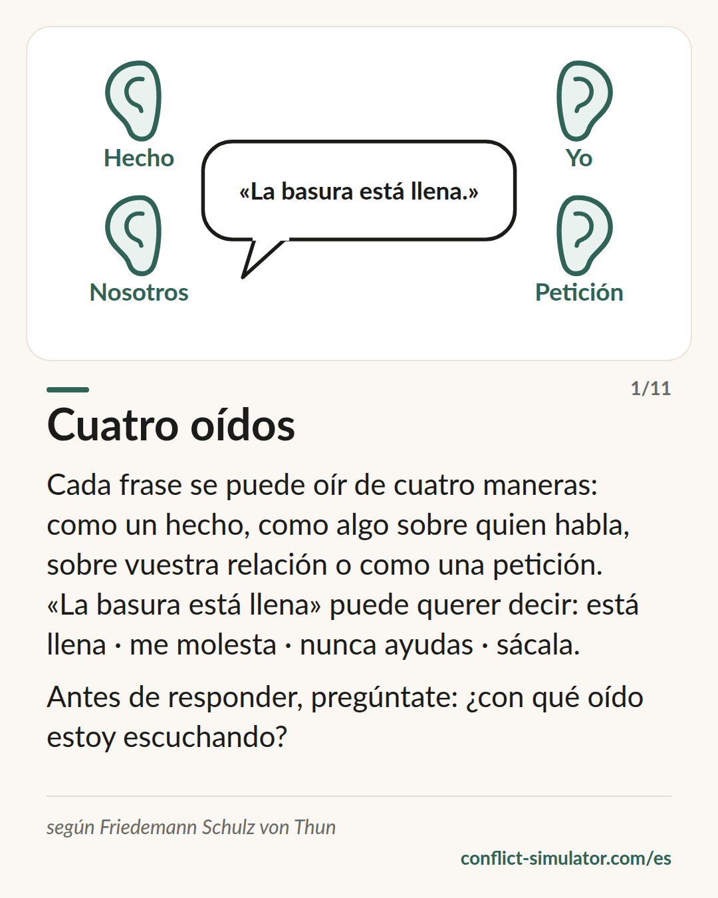

# Cuatro oídos

*Cada mensaje tiene cuatro lados, y quien escucha suele oír uno distinto del que querías decir.*

## Qué dice el modelo

Una frase como «La basura está llena» lleva cuatro mensajes a la vez: un hecho (el cubo está lleno), algo sobre quien habla (esto me molesta), algo sobre la relación (creo que te toca a ti) y una petición (sácala). Friedemann Schulz von Thun lo llama el cuadrado de la comunicación.

La clave está en el que escucha. Quien escucha tiene cuatro oídos y elige, casi siempre sin darse cuenta, con cuál oye. Uno oye el hecho y dice «es verdad». Otra oye la relación y dice «otra vez la culpa es mía». Los dos han oído la misma frase.

Muchos conflictos no empiezan por lo que se dijo, sino por el oído que el otro tenía abierto en ese momento, y porque nadie pregunta.

## De dónde viene

Friedemann Schulz von Thun, psicólogo de Hamburgo, presentó el modelo en 1981 en «Miteinander reden 1» (Rowohlt). Se apoya en la distinción de Watzlawick entre contenido y relación y en el modelo de Bühler. En Alemania está en los planes de estudio de muchos institutos y en el equipo básico de cualquier formación directiva; en español se conoce menos.

La evidencia empírica es escasa: unos pocos estudios de recepción y ningún experimento que distinga cuatro oídos de tres o de cinco. Su fuerza es didáctica: da a la gente un vocabulario para hablar de malentendidos sin acusar a nadie de mala fe. Como tal, es saber práctico, no un hallazgo.

**Respaldo:** Saber práctico, didácticamente fuerte, apenas comprobado

## Qué puedes hacer con él antes de la conversación

### Lee tu primera frase de cuatro maneras

Escríbela. ¿Cuál es el hecho? ¿Qué revelas de ti? ¿Qué dice de vuestra relación? ¿Qué debería hacer el otro? El lado que no pretendías suele ser el que más suena.

### Adivina el oído probable

¿Con qué oído va a escuchar la otra persona, después de todo lo que ha pasado entre vosotros últimamente? Si temes el de la relación, di tú mismo el mensaje de relación antes de que lo adivinen.

### Di en voz alta lo que revelas de ti

«Esto me molesta» es el lado que preferimos callar, y el que el otro lee después en nuestro tono. Dicho en voz alta duele menos que adivinado.

## Dónde lo usa el Simulador de Conflictos

En el paso opcional «El otro lado» del [asistente](https://conflict-simulator.com/es/empezar) tu primera frase está arriba y debajo los cuatro oídos: el simulador propone qué oye probablemente la otra persona en cada lado, y tú lo corriges donde sabes más. El resultado va a tu tarjeta de conversación.

En la [sala de práctica](https://conflict-simulator.com/es/practicar) se añade la dirección contraria: allí responde un interlocutor y, tras una ronda, el coach te pregunta con qué oído acabas de escuchar. La [tarjeta «Cuatro oídos»](https://conflict-simulator.com/es/tarjetas) resume el modelo en una página.

## Límites

El cuadrado explica los malentendidos, pero no los resuelve: no te dice qué lado es el correcto. También invita a reprochar al otro «el oído equivocado», y entonces una herramienta para entender se convierte en un reproche más. Y una frase que de verdad hiere en el lado de la relación no mejora porque la declares «solo un hecho».

## Fuentes

- [Instituto Schulz von Thun: los modelos (alemán)](https://www.schulz-von-thun.de/die-modelle)
- [Modelo de los cuatro lados (Wikipedia, inglés)](https://en.wikipedia.org/wiki/Four-sides_model)
- [Vier-Seiten-Modell (Wikipedia, alemán)](https://de.wikipedia.org/wiki/Vier-Seiten-Modell)

Página: https://conflict-simulator.com/es/fondo/cuatro-oidos
