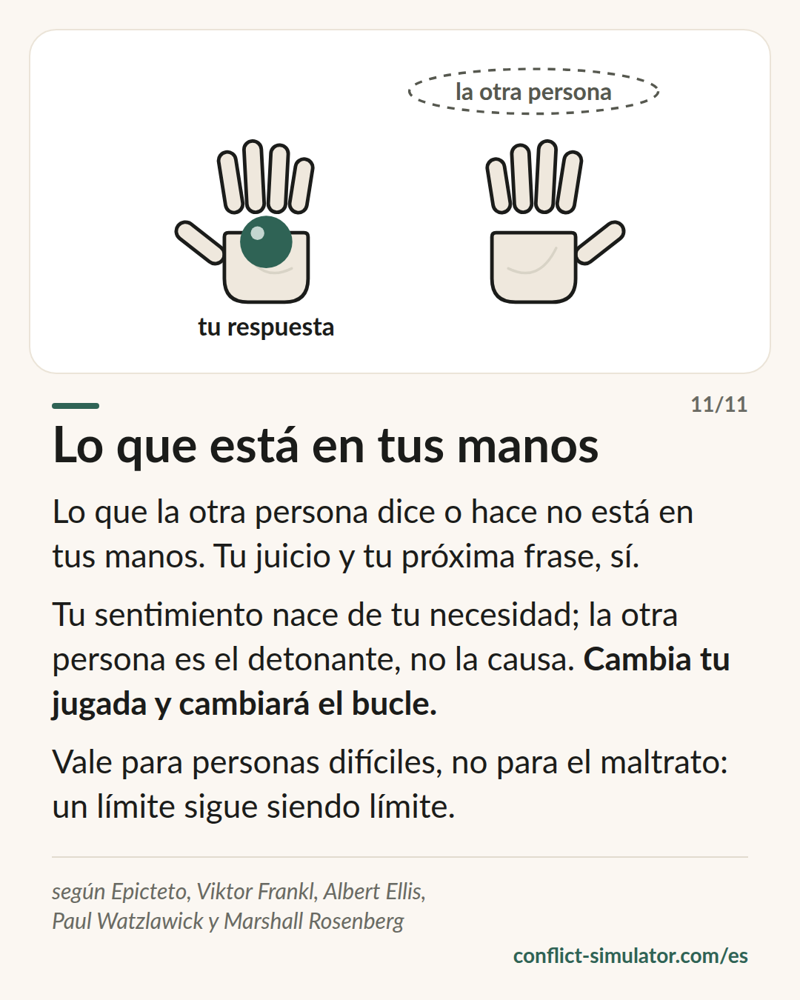

# Lo que está en tus manos

*Lo que dice la otra persona no está en tus manos. Tu juicio y tu próxima frase, sí — y con ellos el bucle en el que estáis.*

## Qué dice el modelo

«Me haces enfadar» suena a descripción, pero es una atribución: pone tu sentimiento en manos de la otra persona.

La distinción es antigua: lo que hacen los demás no depende de ti. Tu juicio, tu sentimiento y tu próxima frase, sí. Este nace de tu necesidad; la otra persona es el detonante, no la causa.

Y como una discusión es un bucle en el que cada lado cree que solo reacciona, basta una jugada distinta: el círculo gira de otro modo sin tu jugada de siempre.

## De dónde viene

La raíz más antigua está antes de los estoicos. El Dhammapada empieza con «la mente precede a todas las cosas» (versos 1–2), y el Sallatha Sutta (SN 36.6) describe dos flechas: el hecho es la primera; la reacción que añadimos, la segunda. Entre el tono del sentir y la reacción hay un hueco; ahí está la práctica de Vipassana. El coach del simulador no enseña a controlar las reacciones, solo a notarlas: «¿Qué parte está en tus manos?», y después una respiración, no una técnica.

Epicteto, Enquiridión 1 y 5 (h. 125 d. C.): unas cosas dependen de nosotros y otras no; no nos perturban las cosas, sino nuestros juicios sobre ellas. Viktor Frankl describió en 1946 la última libertad, elegir la propia actitud; el tan citado «espacio entre estímulo y respuesta» es de Stephen Covey, no de Frankl. Albert Ellis hizo de ello en los años cincuenta el modelo ABC (acontecimiento, creencia, consecuencia), inicio de la terapia racional emotiva y luego de la cognitivo-conductual. La oración de la serenidad de Niebuhr dice lo mismo en tres líneas. Watzlawick mostró en 1983 («El arte de amargarse la vida») cómo alimentamos nuestro bucle y, con la circularidad, por qué una jugada lo cambia.

Las pruebas están repartidas. La reevaluación amortigua los sentimientos: el metaanálisis de Webb, Miles y Sheeran (2012, 306 estudios) encuentra efectos medios, claramente mayores que para la supresión. Que una jugada distinta cambia el bucle es saber práctico de la terapia sistémica, no medido.

**Respaldo:** Reevaluación bien demostrada; el resto, saber práctico

## Qué puedes hacer con él antes de la conversación

### ¿Qué parte está en tus manos?

Escribe la frase que te molesta. Dos columnas: a la izquierda, lo que hace la otra persona; a la derecha, lo que haces tú: juicio, sentimiento, próxima frase. Solo la derecha puedes cambiarla.

### Predecir la jugada de la otra persona

Escribe lo que probablemente dirá y, al lado, tu respuesta tranquila. Con la respuesta ya escrita no hay que inventarla bajo presión.

### Reinterpretar la frase que más duele

Toma la frase que más escuece («Estás exagerando»). ¿Qué otra lectura tiene? «Quiere que sea menos.» No hace falta creerla, solo conocerla.

## Dónde lo usa el Simulador de Conflictos

La lente «De qué va esto para ti» del [asistente](https://conflict-simulator.com/es/empezar) pregunta por sentimiento y necesidad. El paso [si…, entonces…](wenn-dann-plaene.md) es la jugada prevista con tu respuesta ya lista.

En la [sala de práctica](https://conflict-simulator.com/es/practicar) el coach pregunta en la pausa «¿Qué parte está en tus manos?» y envía la [tarjeta «Lo que está en tus manos»](https://conflict-simulator.com/es/tarjetas) cuando una frase culpa a la otra persona de tu sentimiento; la tarjeta «¿Quién empezó?» muestra el bucle.

## Límites

Es una actitud ante personas difíciles, no un motivo para aceptar el maltrato. Quien sufre amenazas, humillación o control no tiene nada que reinterpretar: el nivel rojo de la valoración sigue siendo rojo, y algunas situaciones necesitan una tercera persona: orientación, una jefa, la policía.

## Fuentes

- [Epicteto: Enquiridión (traducción inglesa, MIT Internet Classics Archive)](http://classics.mit.edu/Epictetus/epicench.html)
- [Sallatha Sutta, SN 36.6: La flecha (Access to Insight, en inglés)](https://www.accesstoinsight.org/tipitaka/sn/sn36/sn36.006.than.html)
- [Dhammapada 1–2: La mente precede (Access to Insight, en inglés)](https://www.accesstoinsight.org/tipitaka/kn/dhp/dhp.01.than.html)
- [Webb, Miles & Sheeran (2012): Dealing with feeling. A meta-analysis of emotion regulation strategies. Psychological Bulletin 138(4)](https://doi.org/10.1037/a0027600)

Página: https://conflict-simulator.com/es/fondo/lo-que-esta-en-tus-manos
