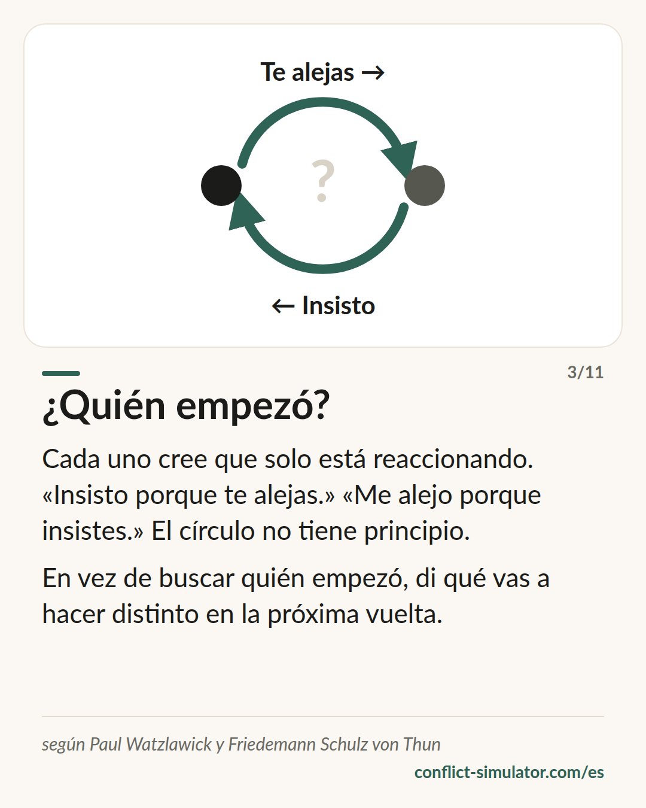

# Los axiomas de Watzlawick

*Es imposible no comunicar, y otras tres frases que explican una pelea antes de que empiece.*

## Qué dice el modelo

En 1967 Paul Watzlawick y sus colegas formularon cinco «axiomas provisionales» de la comunicación. Tres de ellos conviene tenerlos antes de una conversación difícil.

Primero: todo mensaje tiene un aspecto de contenido y otro de relación, y el de relación decide cómo se entiende el contenido. Una pelea por los platos casi nunca va de los platos.

Segundo: cómo se vive una relación depende de la puntuación, de dónde pone cada parte el principio. «Insisto porque te alejas.» «Me alejo porque insistes.» Los dos tienen razón; el círculo no tiene principio.

Tercero: comunicamos de forma digital, con palabras, y analógica, con el tono, el ritmo, la cara. Las palabras llevan el contenido; lo analógico lleva la relación. Cuando no coinciden, el otro se cree lo analógico.

## De dónde viene

Paul Watzlawick, Janet Beavin y Don D. Jackson, «Pragmatics of Human Communication», Norton 1967; en español, «Teoría de la comunicación humana» (Herder). Los autores pertenecían al grupo de Palo Alto en torno a Gregory Bateson y trabajaban en terapia familiar.

Los axiomas son una heurística, no una teoría con predicciones: cuestan de comprobar, y los propios autores los llamaron provisionales. Su influencia en la terapia familiar y en los estudios de comunicación es enorme; su comprobación empírica, escasa. Para preparar una conversación cuentan como saber práctico: útiles como mirada, no como prueba.

**Respaldo:** Saber práctico, influyente, difícil de comprobar

## Qué puedes hacer con él antes de la conversación

### Di en voz alta el nivel de la relación

Di de qué va esto además del asunto: «Va de los platos… y de si te importo». Lo que se dice no hay que adivinarlo en tu tono.

### Escribe el círculo

Dos líneas: «Yo… porque tú…» y «Tú… porque yo…». Quien ve el círculo deja de buscar el principio y empieza a buscar el punto por donde puede salir él mismo.

### Cuadra palabras y tono

Si estás dolido y anuncias «solo un comentario», el otro oye el dolor igual, y reacciona a él, no al comentario. Di lo que hay.

## Dónde lo usa el Simulador de Conflictos

En el paso «El otro lado» del [asistente](https://conflict-simulator.com/es/empezar) rellenas el círculo vicioso en dos líneas; después aparece en tu tarjeta de conversación. La idea de separar contenido y relación también está dentro de las tres capas (hecho, sentimiento, petición): el sentimiento es el nivel de la relación, dicho en voz alta.

Dos [tarjetas](https://conflict-simulator.com/es/tarjetas) llevan el modelo: «Contenido y relación» y «¿Quién empezó?». En la [sala de práctica](https://conflict-simulator.com/es/practicar) el coach se da cuenta cuando los dos pelean por la última palabra.

## Límites

El círculo puede difuminar la responsabilidad: donde hay violencia, amenazas o un claro desnivel de poder sí hay un principio, y nombrarlo no es puntuación, sino necesidad. Y de «es imposible no comunicar» no se sigue que todo se pueda interpretar: el silencio tiene muchos motivos, y hay que preguntarlos en vez de leerlos. La regla tan citada de que la comunicación es un 93 % no verbal no es de Watzlawick y es falsa.

## Fuentes

- [Watzlawick, Beavin, Jackson: Some Tentative Axioms of Communication (1967, capítulo en PDF)](https://www.neoscenes.net/teach/cu/2012_2/atls2000_mit/pdfs/Watzlawick-1967-Some_Tentative_Axioms_of_Communication.pdf)
- [Paul Watzlawick (Wikipedia)](https://es.wikipedia.org/wiki/Paul_Watzlawick)
- [Mental Research Institute, Palo Alto](https://mri.org)

Página: https://conflict-simulator.com/es/fondo/axiomas-de-watzlawick
