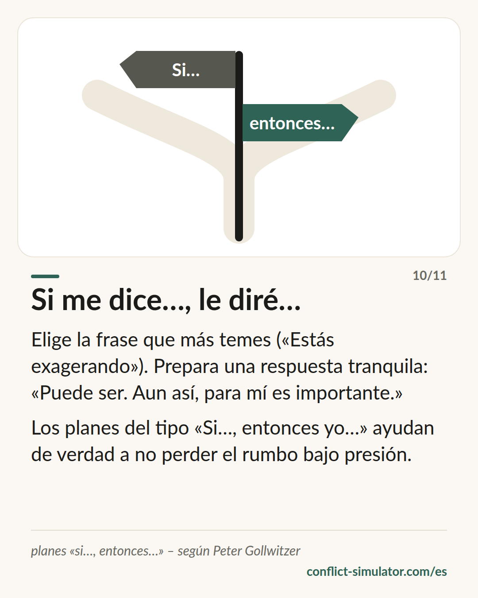

# Planes «si…, entonces…»

*Una frase preparada para el momento que más temes: la herramienta mejor respaldada de esta web.*

## Qué dice el modelo

Tener un objetivo («voy a mantener la calma») ayuda poco cuando llega el momento. Un plan con la forma «si pasa X, entonces hago Y» ayuda mucho más. Peter Gollwitzer lo llama intención de implementación; casi todo el mundo dice plan «si…, entonces…».

El mecanismo: la condición «si» se convierte en una señal que reconoces casi automáticamente en la conversación, y la acción «entonces» ya está esperando. En el segundo caliente no tienes que decidir, solo recordar.

Para una conversación difícil eso significa: elige la frase que más temes («Estás exagerando», «Ya empezamos otra vez») y prepara una respuesta tranquila. «Puede ser. Aun así, para mí es importante.»

## De dónde viene

Peter Gollwitzer, psicólogo social (Constanza, Nueva York), publicó el concepto en 1999 en American Psychologist: «Implementation intentions: Strong effects of simple plans». El metaanálisis de Gollwitzer y Sheeran (2006) reúne 94 estudios y encuentra un efecto entre medio y grande sobre el logro de objetivos (d ≈ 0,65).

Para una herramienta de preparación de conversaciones, es un respaldo poco habitual: experimentos aleatorizados, muchos ámbitos, resultados estables. Gabriele Oettingen lo convirtió en el ejercicio de cuatro pasos «WOOP» (deseo, resultado, obstáculo, plan), también comprobado. Lo demostrado es el efecto sobre tu propia conducta bajo presión, no que la conversación salga bien por ello.

**Respaldo:** Bien respaldado: metaanálisis de 94 estudios

## Qué puedes hacer con él antes de la conversación

### Elige la frase que temes

No diez frases, una. ¿Qué objeción esperas y cuál te sacaría más de tus casillas? Esa es tu «si».

### Una respuesta que no devuelva el golpe

El «entonces» debe ser corto, en primera persona y sin contraataque: «Puede. Aun así quiero hablarlo». Dilo dos veces en voz alta para que te quede en la boca.

### Añade una regla de pausa

Un segundo plan por si se desmadra: «Si noto que levanto la voz, entonces digo: necesito veinte minutos y vuelvo».

## Dónde lo usa el Simulador de Conflictos

Al final del [asistente](https://conflict-simulator.com/es/empezar), «Si la otra persona dice…» te pide justo esta frase: eliges entre las resistencias típicas, recibes una respuesta tranquila y una frase para el caso de que aun así se desmadre. Las dos van a la tarjeta de conversación; el plan «si…, entonces…» también al texto copiado.

La [tarjeta «Si me dice…, le diré…»](https://conflict-simulator.com/es/tarjetas) es la versión corta; en la [sala de práctica](https://conflict-simulator.com/es/practicar) puedes probar la frase contra un interlocutor que de verdad se cierra.

## Límites

Un plan no convierte una mala frase en buena: quien se propone «si me contradice, le digo que nunca entiende nada» lo hará con toda fiabilidad. El plan actúa sobre tu conducta, no sobre la del otro, y no aguanta cuando la conversación ya está en amenazas. Demasiados planes te vuelven rígido; con uno basta.

## Fuentes

- [Gollwitzer (1999): Implementation intentions. American Psychologist 54(7)](https://doi.org/10.1037/0003-066X.54.7.493)
- [Gollwitzer y Sheeran (2006): metaanálisis, Advances in Experimental Social Psychology 38](https://doi.org/10.1016/S0065-2601(06)38002-1)
- [Gabriele Oettingen: WOOP](https://woopmylife.org)

Página: https://conflict-simulator.com/es/fondo/planes-si-entonces
